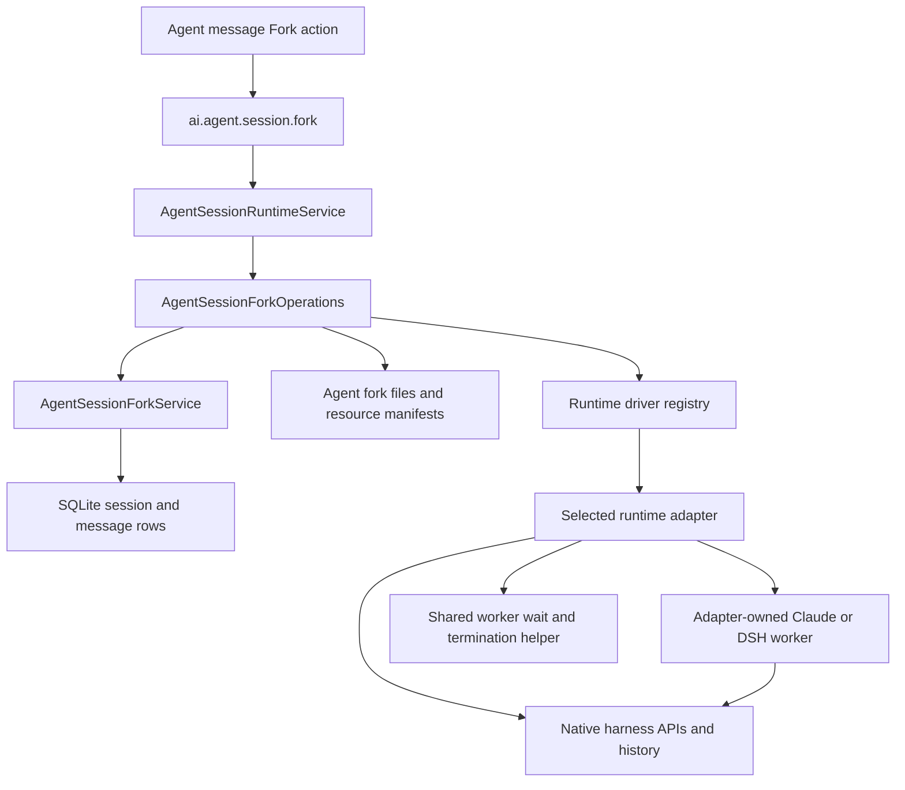

# Agent Session Fork

## Behavior

Pi, Claude Code, and DSH support **Fork** on completed assistant messages.
The operation creates an independent Agent session containing the visible
history through the selected turn and a native runtime resume reference.
It does not start or interrupt the source connection. The source can continue
appending later turns, and deleting it does not invalidate a published child.

The last copied message carries a `data-agent-session-fork` part containing only
`sourceSessionId`. Its link opens the direct parent after checking it still exists;
missing or trashed parents produce a frontend error. Forking again replaces inherited
markers. The link stays at the copied boundary, with no backfill for existing forks.

The new name uses the next available suffix for the Agent, such as `Session (1)`.
Forking a numbered session advances that suffix instead of nesting it. Queued
deliveries, live tasks, approval authority, and usage statistics are not inherited.
Copied unfinished tool calls become terminal errors; they do not resume execution.

User workspaces remain shared. System workspaces copy their **current** files into
the child's workspace; selecting an earlier turn does not restore historical file
versions. Copying detects file changes and can fail with `workspace_changed`.
Shared-workspace editing remains the responsibility of the sessions using it.

## Ownership and dependencies

| Owner | Responsibility |
|---|---|
| `AgentSessionRuntimeService` | Lifecycle and admission: owns the operation coordinator, includes pending forks in drain, and cancels work on shutdown |
| `AgentSessionForkOperations` | Coordinates message selection, workspace preparation, adapter invocation, artifact publication, database commit, and failed-operation cleanup |
| `AgentSessionForkService` in `data/services` | Reads a consistent source prefix and commits child session/message rows in a synchronous database transaction |
| `agentSession/fork/files.ts` and `resources.ts` | Copy/publish files and record the resources owned by an operation |
| Each runtime adapter | Defines and validates its native checkpoint, reads native history, calls the harness fork API, and maps child resume references |
| `runtime/fork` | Common request/result envelope, errors, native-file read helpers, and worker waiting; no runtime-specific checkpoint union or worker dispatch |
| Harness | Native history semantics, context management, summaries, compaction, and persistence |

`AgentSessionForkOperations` is owned by the existing runtime lifecycle service;
it is not an additional container service. The data service does not perform
filesystem work or call runtime adapters. The fork command uses IpcApi because it
coordinates runtime and filesystem operations in addition to SQLite writes.

## Checkpoints and the read/write path

1. At turn completion, the adapter validates its native checkpoint and attaches
   it to the `turn-complete` event. The host records queued message IDs to exclude.
2. `AgentSessionMessageBackend` validates the common envelope and saves it in the
   existing message's private `data.runtimeAnchor`. If checkpoint validation or
   checkpoint persistence fails, the completed answer is still saved without it.
3. Fork reads the selected message prefix. The message must be a successful
   assistant turn with an anchor matching the Agent's runtime. Pending deliveries
   and the anchor's excluded message IDs are omitted.
4. The coordinator prepares the workspace and staging directory. The selected
   adapter validates native fields, forks the native boundary, and returns a child
   `resumeToken`, remapped checkpoints, and artifact source/target paths.
5. The coordinator clones visible messages with new IDs, remaps their anchors,
   strips execution state and statistics, and publishes the native artifacts.
6. `DbService.withWriteTx` rechecks the source prefix, Agent, and workspace, then
   creates the child and its messages atomically. Later source appends are allowed;
   changes to the selected prefix fail with `source_changed`. A read-model change
   notification follows the commit, and IPC returns the child session ID.

The public checkpoint envelope knows only `runtime`; all other checkpoint fields
are opaque to the host and data layer. Native schemas live in each adapter's
`forkCheckpoint.ts` and validate capture, fork input, and remapped results. Public
message reads strip `runtimeAnchor`. The child uses the existing
`runtimeResumeToken` persistence and normal runtime resume path.

No new database table or `app_state` fork record is required. Cherry does not
generate a summary, reconstruct model context from UI messages, or apply Chat
compression settings to Agent forks.

## Native adapter paths

| Adapter | Native boundary | Fork implementation |
|---|---|---|
| Pi | Runtime session ID and leaf ID | Stages the newest matching native file, as normal resume does, then branches with `SessionManager` and maps checkpoints to the child session ID |
| Claude Code | Runtime session ID, main assistant UUID, and config directory | Its private worker calls the SDK fork API and maps assistant UUIDs into the child's transcript |
| DSH | Runtime session ID and completed `turn/end` boundary | Its private worker calls the bundled bridge fork entry with a live snapshot or stored native history; the bridge creates and persists a seeded child |

DSH waits for an existing connection to finish startup before requesting a snapshot. Failure
of that request is reported rather than retried against potentially stale stored
history. A cold fork reads stored history without starting the source Agent loop.
A closing connection remains registered until teardown finishes before Fork reads
its persisted history. Startup and shutdown waits are cancellable and limited to 60 seconds each.

Claude and DSH create their own workers and pass them to `runForkWorker`. The
shared helper returns an opaque result and waits for termination on success,
failure, cancellation, or timeout before the coordinator can clean up files.
Adapters validate the returned native result before publication.

## Publication and failure cleanup

The operation writes a resource manifest at
`application.getPath('feature.agents.forks', '<operationId>.json')` before creating
resources. It records staging paths, published artifacts, and filesystem identities
needed to establish ownership. This manifest describes file ownership, not runtime
context or a separate session recovery state machine.

Native files are published before the child database transaction. A failed or
interrupted operation can therefore leave files without a child row. Recovery
checks whether the target session exists: published children are preserved, while
unpublished operations clean up only resources whose ownership can be established.
An adopted workspace is retained; unreadable manifests or changed file identities
remain available for later investigation rather than authorizing deletion.

Successful forks currently retain their staging resources and manifests, including
Pi lineage snapshots. These are not discarded as temporary files on success.
Normal session resume uses the persisted native resume token; startup resource
recovery handles incomplete publication, not missing harness history.

Missing anchors (`legacy_history`), unsupported checkpoints, missing or corrupt
native history, and changed source/workspace data produce explicit fork errors.
For an unflushed Claude transcript, retry after the runtime writes it. There is no
UI-history import or empty-session fallback when native history is unavailable.

## Related references

- [Agent Session Runtime](./agent-session-runtime.md) — host lifecycle, follow-ups, and resume
- [Adding an Agent Runtime](./adding-a-runtime.md) — driver registration and capability boundaries
- [Data Layer](../data/README.md) — SQLite service and transaction conventions
