# Remote Agent Sequences and Modules

> **目标设计，尚未实现。** 图中的新增模块是职责划分，不代表已经存在的类或文件；
> 一个职责不必对应一个独立服务。消息与方法以 [API 设计](./remote-agent-access.md) 为准，
> 实现顺序见 [架构方案](../api-gateway/remote-agent-access.md#implementation-order-and-acceptance)。

文件落点、函数签名与事务边界见 [实现设计](./remote-agent-implementation.md)。

按[共用基础设施决策](../api-gateway/remote-agent-access.md#shared-infrastructure-for-configuration-transfer-and-agent-access)，
配置传输与 Agent 在同一次配对中确认能力，共用认证和加密连接。S01 展示其中的 Agent
授权部分，不表示配置传输配对成功后还要再进行一次 Agent 授权；统一配对结果仍待补齐。

连接和恢复编排由项目内的小模块管理；WebSocket、JSON-RPC、加密和平台安全存储复用成熟实现。
图中的网络调用都在经过认证的加密通道内，底层安全握手除外。JSON-RPC `id` 关联一次调用，
`commandId` 关联持久化业务命令，`epoch + seq` 标识可恢复的事件位置。
图中 `sessions.*`、`messages.*`、`subscriptions.*` 等简写均属于 `agent.*` 命名空间。
设备批准后统一支持查看、发送、审批和取消，不配置 Agent/session/workspace 范围。
`grantId` 只标识授权代次；关闭后再次批准必须生成新 ID，旧待确认命令不得换 ID 自动续发。

旧 PR #20717 的原型代码已备份并从工作树撤下；本文保留目标设计。`remoteAccess`、
`RemoteCommandService` 及原型新增的 owner 接口均需重新实现，不能视为现有基线能力。

## Module map

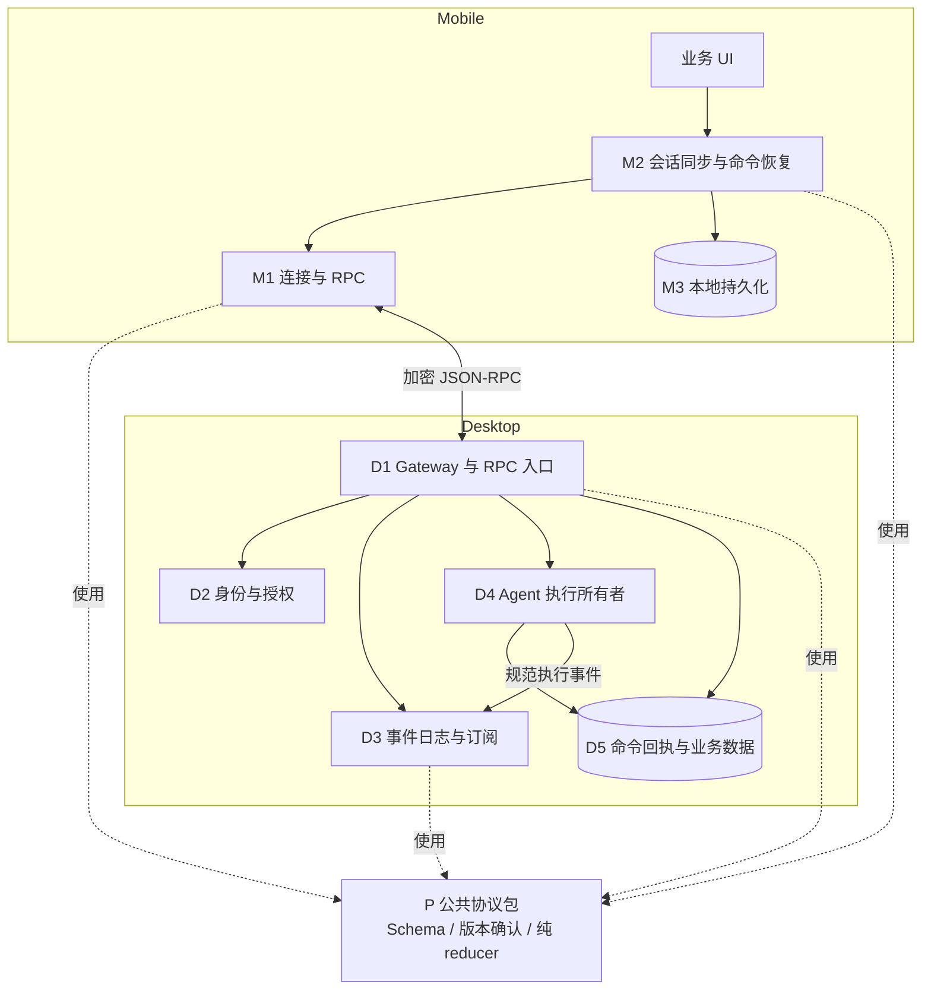
```mermaid
flowchart TB
    subgraph Mobile
        UI[业务 UI]
        M1[M1 连接与 RPC]
        M2[M2 会话同步与命令恢复]
        M3[(M3 本地持久化)]
        UI --> M2
        M2 --> M1
        M2 --> M3
    end
    P[P 公共协议包<br/>Schema / 版本确认 / 纯 reducer]
    M1 -. 使用 .-> P
    M2 -. 使用 .-> P
    subgraph Desktop
        D1[D1 Gateway 与 RPC 入口]
        D2[D2 身份与授权]
        D3[D3 事件日志与订阅]
        D4[D4 Agent 执行所有者]
        D5[(D5 命令回执与业务数据)]
        D1 --> D2
        D1 --> D3
        D1 --> D4
        D1 --> D5
        D4 --> D5
        D4 -->|规范执行事件| D3
    end
    M1 <-->|加密 JSON-RPC| D1
    D1 -. 使用 .-> P
    D3 -. 使用 .-> P
```

| 模块 | 负责什么 | 代码落点与状态 |
|---|---|---|
| **P 公共协议包** | JSON-RPC 校验、方法映射、版本协商、Agent DTO、纯 reducer、命令规范化 | 拟新增 `packages/remote-protocol`，根入口与 `/agent`；没有 socket、定时器、数据库或平台密钥 |
| **M1 连接与 RPC** | 连接状态机、退避、握手、协商、认证、请求关联、连接代次与过期回调隔离 | Mobile 拟新增于 `src/backend/services/remoteAccess`；调用平台安全存储适配器，复用 JSON-RPC 库 |
| **M2 会话同步与命令恢复** | 订阅、分页检查点、事件应用、ACK、待确认命令核对 | 同一 Mobile 业务模块内的会话职责；通过 `src/shared/contracts` 暴露语义接口，不暴露网络报文 |
| **M3 本地持久化** | 投影与游标原子提交、待确认命令、回执；缓存按 desktop/device/grantId（授权代次）/protocolVersion/session 隔离 | Mobile `src/backend/data` 的所属数据服务；私钥和令牌不放这里 |
| **D1 Gateway 与 RPC 入口** | 路由隔离、连接准入、解密后校验、限流、按方法派发与关闭清理 | 扩展现有 `src/main/features/apiGateway`；新增 `src/main/services/remoteAccess` |
| **D2 身份与授权** | 配对声明、桌面确认、设备密钥证明、Agent 访问开关/授权代次、续期、撤销 | 扩展现有 paired-device 记录，不建授权表；provider 配对不自动启用 Agent 访问 |
| **D3 事件日志与订阅** | 会话/protocolVersion 的 epoch、不可变事件、检查点、保留窗口、发送额度 | 重写 `RemoteAgentSubscription.ts` 的快照机制，新增日志/检查点职责；不执行 Agent |
| **D4 Agent 执行所有者** | 既有 stream listener/状态通知、空闲预条件、执行准入、审批/取消串行化、最终持久化 | 复用并扩展 `AiStreamManager`、Agent lifecycle/runtime、审批所有者；不得依赖 remoteAccess |
| **D5 命令回执与业务数据** | 设备/授权代次内幂等回执、事务、tombstone、历史和内容版本 | 新增 `RemoteCommandService`，扩展所属数据服务，数据库变更走追加迁移 |
| **R Relay** | 将密文字节送到 Desktop，隧道与缓冲上限 | 后续 Go relay；不解读 Agent 方法，不决定设备授权，不执行 Agent |

图中 D1→D4 的调用可以经过 remote adapter；省略纯转发层。D4 与 D3 的依赖方向是
D3 复用 D4 的 StreamListener、addListener，并按需补充 observeTopic 及 runtime 通知，D4 不导入 D3。P 是两端本地调用的库，不是网络参与者。

## Connection states

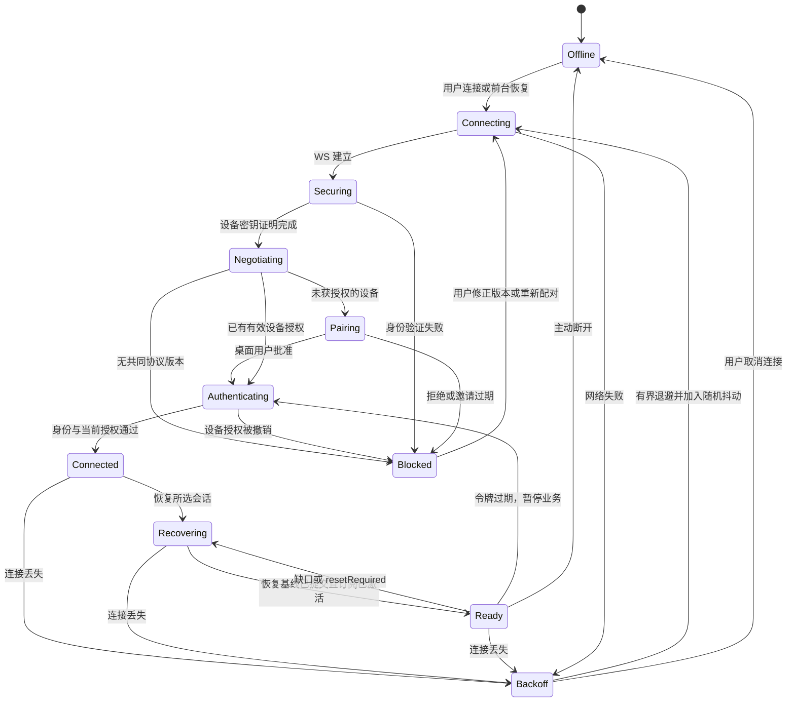
```mermaid
stateDiagram-v2
    [*] --> Offline
    Offline --> Connecting: 用户连接或前台恢复
    Connecting --> Securing: WS 建立
    Securing --> Negotiating: 设备密钥证明完成
    Negotiating --> Pairing: 未获授权的设备
    Pairing --> Authenticating: 桌面用户批准
    Negotiating --> Authenticating: 已有有效设备授权
    Authenticating --> Connected: 身份与当前授权通过
    Connected --> Recovering: 恢复所选会话
    Recovering --> Ready: 恢复基线已提交且订阅已激活
    Ready --> Recovering: 缺口或 resetRequired
    Ready --> Authenticating: 令牌过期，暂停业务
    Connected --> Backoff: 连接丢失
    Recovering --> Backoff: 连接丢失
    Ready --> Backoff: 连接丢失
    Connecting --> Backoff: 网络失败
    Backoff --> Connecting: 有界退避并加入随机抖动
    Negotiating --> Blocked: 无共同协议版本
    Authenticating --> Blocked: 设备授权被撤销
    Securing --> Blocked: 身份验证失败
    Pairing --> Blocked: 拒绝或邀请过期
    Blocked --> Connecting: 用户修正版本或重新配对
    Ready --> Offline: 主动断开
    Backoff --> Offline: 用户取消连接
```

这是主路径示意；任一阶段的网络中断均可进入 Backoff，任一状态都允许用户主动停止。
“Connected”仅表示连接已认证，不表示某会话已同步。Ready 是当前会话的 UI 就绪状态，
不是一个新增 wire 字段。多会话各自同步，单个订阅失败不必关闭健康订阅。
M1 每次建连产生新的本地 generation，旧连接的定时器、回调和迟到响应不得推进新连接状态。
检查点路径在完整安装和 activate 成功后具备同步基线；回放路径还需应用至 subscribe 返回的
highWatermark。Ready 不承诺状态永不落后，后续增量继续应用；写操作始终以 Desktop 当前
状态和预条件检查为准。不为 UI 就绪状态增加额外 RPC 或改变已有方法的响应顺序。

## Scenario index

| 场景 | 主要模块 | 核心验收条件 |
|---|---|---|
| [S01 首次配对](#s01-first-pairing) | M1、D1、D2 | 扫码仅提交声明，桌面确认才产生授权 |
| [S02 协议协商](#s02-version-negotiation) | M1、P、D1 | 无共同版本不进入业务；不同应用版本可使用同一完整协议 |
| [S03 初次同步](#s03-checkpoint-and-activation) | M2、M3、D3、D4 | 检查点与后续事件之间没有缺口 |
| [S04 正常发送与生成](#s04-send-and-stream) | M2、M3、D1、D3、D4、D5 | 回执、手机落盘、桌面完成是三个时刻 |
| [S05 回执丢失](#s05-lost-command-receipt) | M2、M3、D4、D5 | 相同 commandId 不重复执行 |
| [S06 短时断线](#s06-reconnect-and-replay) | M1、M2、M3、D3 | 从已落盘游标续传，旧密文不直接重放 |
| [S07 历史失效或 Desktop 重启](#s07-reset-and-desktop-restart) | M2、D3、D4、D5 | 明确重置，不为恢复文字重跑 Agent |
| [S08 Mobile 崩溃](#s08-mobile-crash) | M2、M3、D3 | 投影与游标同时提交，重复事件不重复应用 |
| [S09 审批竞争](#s09-approval-race) | M2、D2、D4、D5 | 过期输入/已决交互不能被旧审批覆盖 |
| [S10 取消竞争](#s10-cancellation-race) | D1、D4、D5 | 取消 E1 不误伤 E2 |
| [S11 令牌过期与撤销](#s11-expiry-and-revocation) | M1、D1、D2、D3 | 过期可重新证明身份，撤销必须停止 |
| [S12 慢客户端与 ACK](#s12-backpressure) | M2、M3、D3 | 慢客户端不阻塞 Agent，伪造 ACK 不释放额度 |
| [S13 Relay 中断](#s13-relay-interruption) | M1、R、D1、D3 | 隧道重连不等于会话 epoch 改变 |

## S01 First pairing

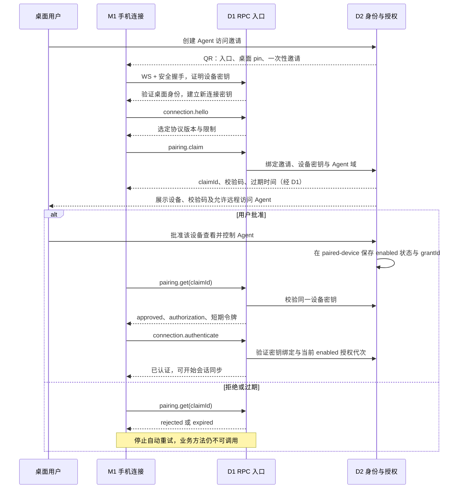
```mermaid
sequenceDiagram
    participant U as 桌面用户
    participant M as M1 手机连接
    participant G as D1 RPC 入口
    participant A as D2 身份与授权
    U->>A: 创建 Agent 访问邀请
    A-->>M: QR：入口、桌面 pin、一次性邀请
    M->>G: WS + 安全握手，证明设备密钥
    G-->>M: 验证桌面身份，建立新连接密钥
    M->>G: connection.hello
    G-->>M: 选定协议版本与限制
    M->>G: pairing.claim
    G->>A: 绑定邀请、设备密钥与 Agent 域
    A-->>M: claimId、校验码、过期时间（经 D1）
    A-->>U: 展示设备、校验码及允许远程访问 Agent
    alt 用户批准
        U->>A: 批准该设备查看并控制 Agent
        A->>A: 在 paired-device 保存 enabled 状态与 grantId
        M->>G: pairing.get(claimId)
        G->>A: 校验同一设备密钥
        G-->>M: approved、authorization、短期令牌
        M->>G: connection.authenticate
        G->>A: 验证密钥绑定与当前 enabled 授权代次
        G-->>M: 已认证，可开始会话同步
    else 拒绝或过期
        M->>G: pairing.get(claimId)
        G-->>M: rejected 或 expired
        Note over M,G: 停止自动重试，业务方法仍不可调用
    end
```

**验收：** 只有邀请或旧 provider token 的客户端不能执行 Agent；丢失批准响应时，
同一设备密钥可在声明有效期内恢复结果，另一个设备不能领取。

## S02 Version negotiation

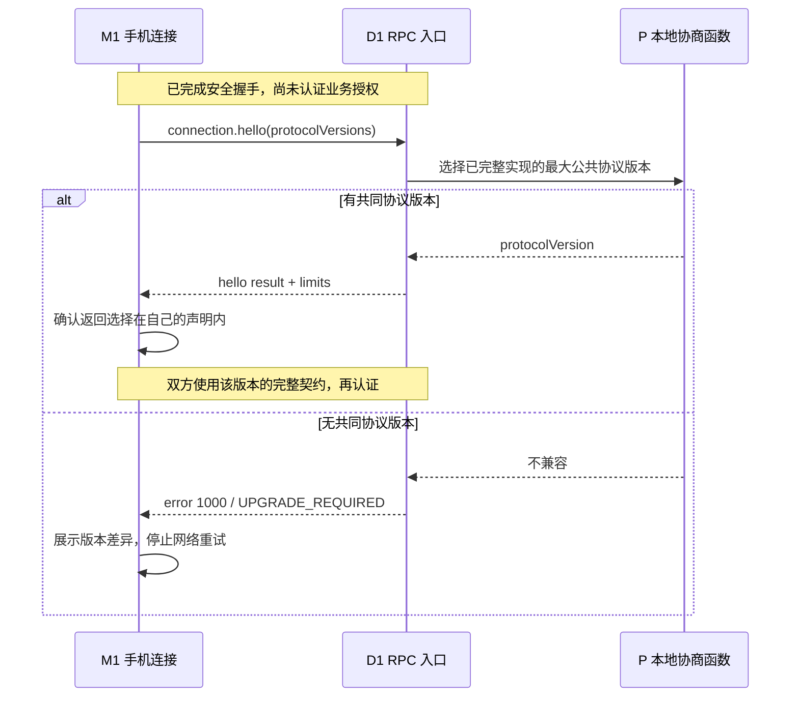
```mermaid
sequenceDiagram
    participant M as M1 手机连接
    participant G as D1 RPC 入口
    participant P as P 本地协商函数
    Note over M,G: 已完成安全握手，尚未认证业务授权
    M->>G: connection.hello(protocolVersions)
    G->>P: 选择已完整实现的最大公共协议版本
    alt 有共同协议版本
        P-->>G: protocolVersion
        G-->>M: hello result + limits
        M->>M: 确认返回选择在自己的声明内
        Note over M,G: 双方使用该版本的完整契约，再认证
    else 无共同协议版本
        P-->>G: 不兼容
        G-->>M: error 1000 / UPGRADE_REQUIRED
        M->>M: 展示版本差异，停止网络重试
    end
```

**验收：** `jsonrpc: "2.0"` 固定；Mobile/Desktop 应用版本可以不同，但必须共同支持选定
协议的完整契约。无 capabilities 列表，旧版连接不接收新版事件；协议兼容不替代设备授权。

## S03 Checkpoint and activation

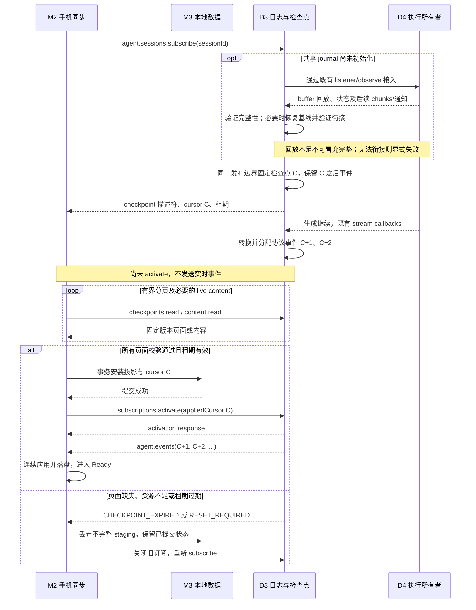
```mermaid
sequenceDiagram
    participant M as M2 手机同步
    participant L as M3 本地数据
    participant J as D3 日志与检查点
    participant E as D4 执行所有者
    M->>J: agent.sessions.subscribe(sessionId)
    opt 共享 journal 尚未初始化
        J->>E: 通过既有 listener/observe 接入
        E-->>J: buffer 回放、状态及后续 chunks/通知
        J->>J: 验证完整性；必要时恢复基线并验证衔接
        Note over J,E: 回放不足不可冒充完整；无法衔接则显式失败
    end
    J->>J: 同一发布边界固定检查点 C，保留 C 之后事件
    J-->>M: checkpoint 描述符、cursor C、租期
    E-->>J: 生成继续，既有 stream callbacks
    J->>J: 转换并分配协议事件 C+1、C+2
    Note over M,J: 尚未 activate，不发送实时事件
    loop 有界分页及必要的 live content
        M->>J: checkpoints.read / content.read
        J-->>M: 固定版本页面或内容
    end
    alt 所有页面校验通过且租期有效
        M->>L: 事务安装投影与 cursor C
        L-->>M: 提交成功
        M->>J: subscriptions.activate(appliedCursor C)
        J-->>M: activation response
        J-->>M: agent.events(C+1, C+2, ...)
        M->>M: 连续应用并落盘，进入 Ready
    else 页面缺失、资源不足或租期过期
        J-->>M: CHECKPOINT_EXPIRED 或 RESET_REQUIRED
        M->>L: 丢弃不完整 staging，保留已提交状态
        M->>J: 关闭旧订阅，重新 subscribe
    end
```

**验收：** 既有流的回放/初始状态与后续 chunks 无缺口、不重复；journal 在同一发布边界
固定 checkpoint C 与其后缀。不要求新增捕获 API，也不能先异步读快照再假定订阅自然衔接。
回放不足要恢复完整基线或显式失败；固定内容计入预算，不能截断后冒充完整检查点。

## S04 Send and stream

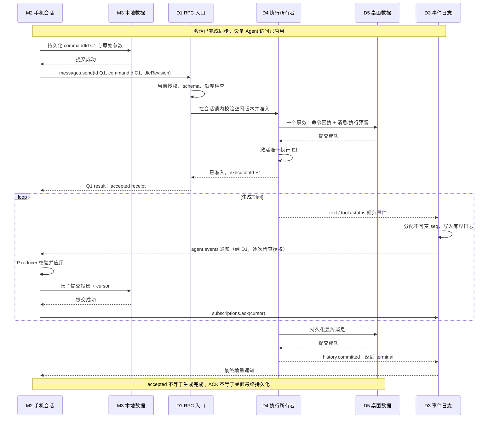
```mermaid
sequenceDiagram
    participant M as M2 手机会话
    participant L as M3 本地数据
    participant G as D1 RPC 入口
    participant E as D4 执行所有者
    participant D as D5 桌面数据
    participant J as D3 事件日志
    Note over M,J: 会话已完成同步，设备 Agent 访问已启用
    M->>L: 持久化 commandId C1 与原始参数
    L-->>M: 提交成功
    M->>G: messages.send(id Q1, commandId C1, idleRevision)
    G->>G: 当前授权、schema、额度检查
    G->>E: 在会话锁内校验空闲版本并准入
    E->>D: 一个事务：命令回执 + 消息/执行预留
    D-->>E: 提交成功
    E->>E: 激活唯一执行 E1
    E-->>G: 已准入，executionId E1
    G-->>M: Q1 result：accepted receipt
    loop 生成期间
        E-->>J: text / tool / status 规范事件
        J->>J: 分配不可变 seq，写入有界日志
        J-->>M: agent.events 通知（经 D1，逐次检查授权）
        M->>M: P reducer 校验并应用
        M->>L: 原子提交投影 + cursor
        L-->>M: 提交成功
        M->>J: subscriptions.ack(cursor)
    end
    E->>D: 持久化最终消息
    D-->>E: 提交成功
    E-->>J: history.committed，然后 terminal
    J-->>M: 最终增量通知
    Note over M,D: accepted 不等于生成完成；ACK 不等于桌面最终持久化
```

**验收：** UI 可提前显示“发送中”，但实际发包在 C1 本地持久化之后。
每次通知不携带不断增长的整份文本；发送授权检查与执行准入还要阻止撤销竞争。

## S05 Lost command receipt

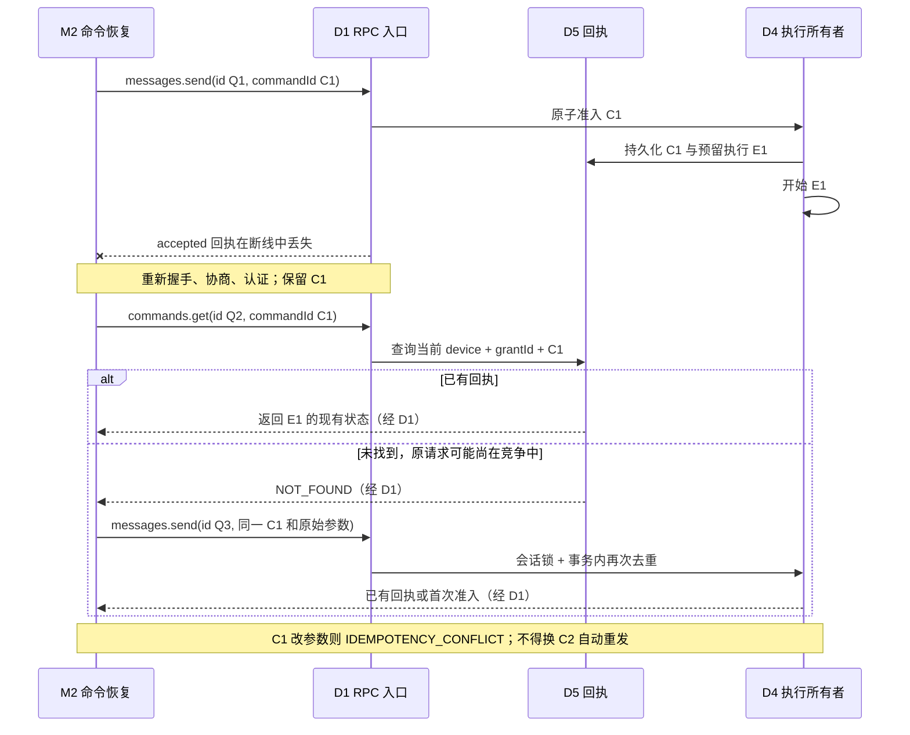
```mermaid
sequenceDiagram
    participant M as M2 命令恢复
    participant G as D1 RPC 入口
    participant D as D5 回执
    participant E as D4 执行所有者
    M->>G: messages.send(id Q1, commandId C1)
    G->>E: 原子准入 C1
    E->>D: 持久化 C1 与预留执行 E1
    E->>E: 开始 E1
    G--xM: accepted 回执在断线中丢失
    Note over M,G: 重新握手、协商、认证；保留 C1
    M->>G: commands.get(id Q2, commandId C1)
    G->>D: 查询当前 device + grantId + C1
    alt 已有回执
        D-->>M: 返回 E1 的现有状态（经 D1）
    else 未找到，原请求可能尚在竞争中
        D-->>M: NOT_FOUND（经 D1）
        M->>G: messages.send(id Q3, 同一 C1 和原始参数)
        G->>E: 会话锁 + 事务内再次去重
        E-->>M: 已有回执或首次准入（经 D1）
    end
    Note over M,E: C1 改参数则 IDEMPOTENCY_CONFLICT；不得换 C2 自动重发
```

**验收：** 网络超时不能直接将命令标记为“未执行”；相同 C1 在合法设备授权代次内至多准入一次。

## S06 Reconnect and replay

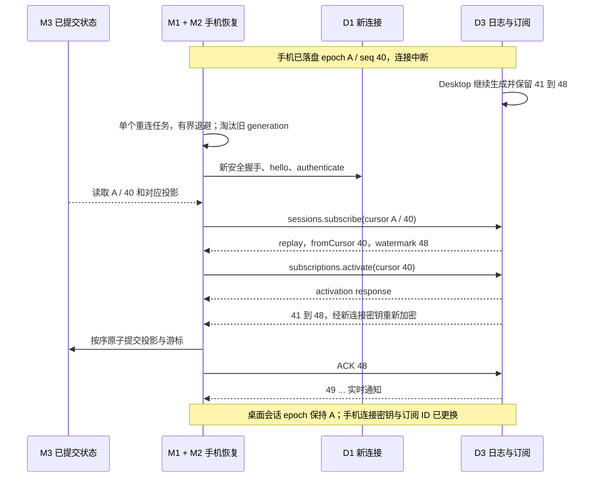
```mermaid
sequenceDiagram
    participant L as M3 已提交状态
    participant M as M1 + M2 手机恢复
    participant G as D1 新连接
    participant J as D3 日志与订阅
    Note over M,J: 手机已落盘 epoch A / seq 40，连接中断
    J->>J: Desktop 继续生成并保留 41 到 48
    M->>M: 单个重连任务，有界退避；淘汰旧 generation
    M->>G: 新安全握手、hello、authenticate
    L-->>M: 读取 A / 40 和对应投影
    M->>J: sessions.subscribe(cursor A / 40)
    J-->>M: replay，fromCursor 40，watermark 48
    M->>J: subscriptions.activate(cursor 40)
    J-->>M: activation response
    J-->>M: 41 到 48，经新连接密钥重新加密
    M->>L: 按序原子提交投影与游标
    M->>J: ACK 48
    J-->>M: 49 ... 实时通知
    Note over M,J: 桌面会话 epoch 保持 A；手机连接密钥与订阅 ID 已更换
```

**验收：** 恢复位置来自落盘游标而非最后收到的 seq；先恢复身份，再允许任何旧命令重试。

## S07 Reset and desktop restart

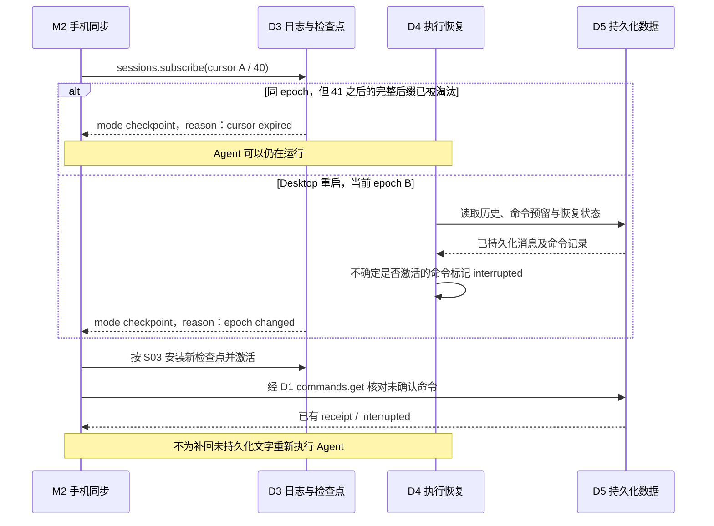
```mermaid
sequenceDiagram
    participant M as M2 手机同步
    participant J as D3 日志与检查点
    participant E as D4 执行恢复
    participant D as D5 持久化数据
    M->>J: sessions.subscribe(cursor A / 40)
    alt 同 epoch，但 41 之后的完整后缀已被淘汰
        J-->>M: mode checkpoint，reason：cursor expired
        Note over M,E: Agent 可以仍在运行
    else Desktop 重启，当前 epoch B
        E->>D: 读取历史、命令预留与恢复状态
        D-->>E: 已持久化消息及命令记录
        E->>E: 不确定是否激活的命令标记 interrupted
        J-->>M: mode checkpoint，reason：epoch changed
    end
    M->>J: 按 S03 安装新检查点并激活
    M->>D: 经 D1 commands.get 核对未确认命令
    D-->>M: 已有 receipt / interrupted
    Note over M,E: 不为补回未持久化文字重新执行 Agent
```

**验收：** 检查点诚实反映已保存状态与中断事实；新 epoch 不接受旧 ACK。
这与备份恢复不同：备份恢复还必须撤销恢复出的设备凭证和 Agent 授权。

## S08 Mobile crash

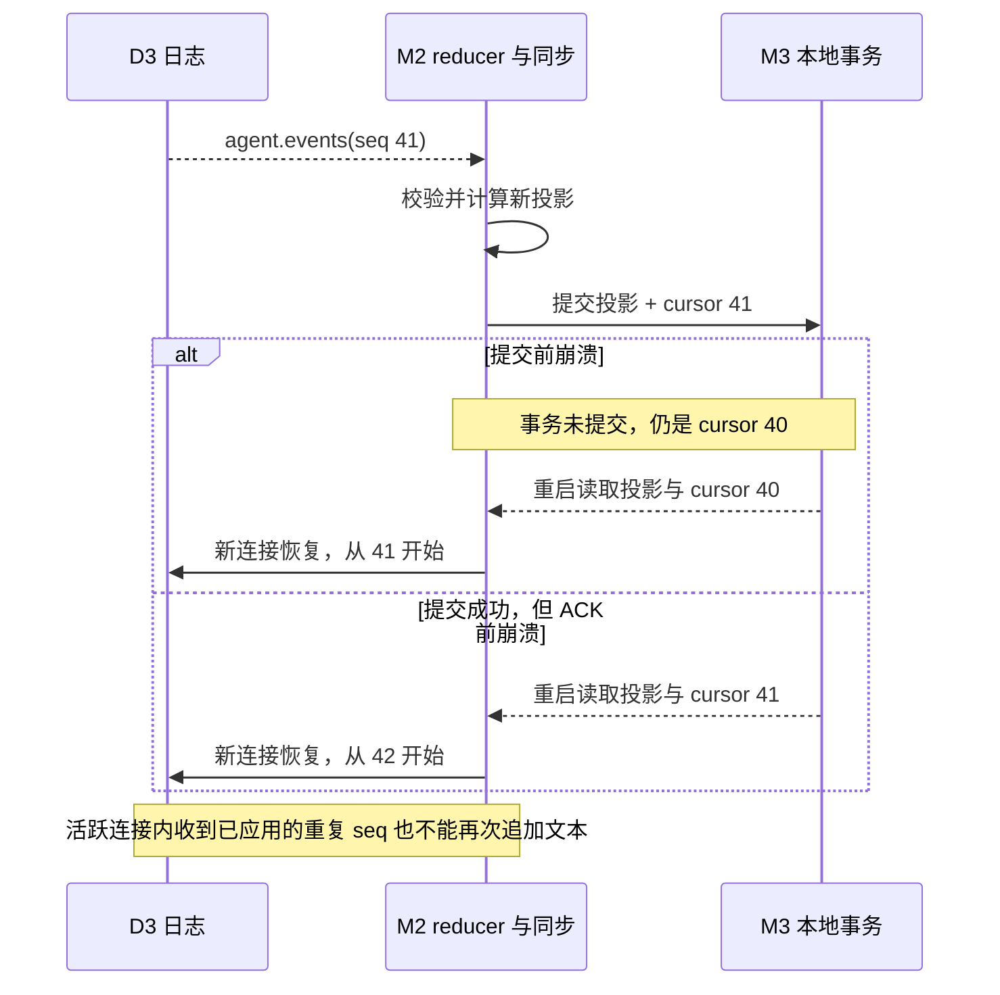
```mermaid
sequenceDiagram
    participant J as D3 日志
    participant M as M2 reducer 与同步
    participant L as M3 本地事务
    J-->>M: agent.events(seq 41)
    M->>M: 校验并计算新投影
    M->>L: 提交投影 + cursor 41
    alt 提交前崩溃
        Note over M,L: 事务未提交，仍是 cursor 40
        L-->>M: 重启读取投影与 cursor 40
        M->>J: 新连接恢复，从 41 开始
    else 提交成功，但 ACK 前崩溃
        L-->>M: 重启读取投影与 cursor 41
        M->>J: 新连接恢复，从 42 开始
    end
    Note over M,J: 活跃连接内收到已应用的重复 seq 也不能再次追加文本
```

**验收：** 不存在“游标 41、投影却只到 40”的可提交状态。
若实现不能原子存储，两者一起丢弃并重新检查点，不能单独保存游标。

## S09 Approval race

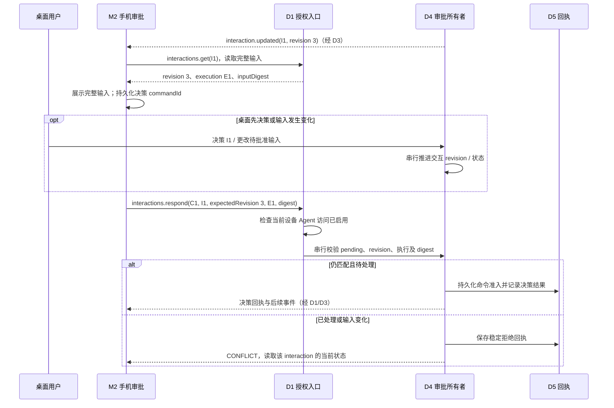
```mermaid
sequenceDiagram
    participant U as 桌面用户
    participant M as M2 手机审批
    participant G as D1 授权入口
    participant E as D4 审批所有者
    participant D as D5 回执
    E-->>M: interaction.updated(I1, revision 3)（经 D3）
    M->>G: interactions.get(I1)，读取完整输入
    G-->>M: revision 3、execution E1、inputDigest
    M->>M: 展示完整输入；持久化决策 commandId
    opt 桌面先决策或输入发生变化
        U->>E: 决策 I1 / 更改待批准输入
        E->>E: 串行推进交互 revision / 状态
    end
    M->>G: interactions.respond(C1, I1, expectedRevision 3, E1, digest)
    G->>G: 检查当前设备 Agent 访问已启用
    G->>E: 串行校验 pending、revision、执行及 digest
    alt 仍匹配且待处理
        E->>D: 持久化命令准入并记录决策结果
        E-->>M: 决策回执与后续事件（经 D1/D3）
    else 已处理或输入变化
        E->>D: 保存稳定拒绝回执
        E-->>M: CONFLICT，读取该 interaction 的当前状态
    end
```

**验收：** 相同 commandId 的重试返回原回执；另一个命令不能用旧输入批准新工具调用。
授权撤销与决策准入必须有明确串行化边界，不能仅在 RPC 入口检查一次。

## S10 Cancellation race

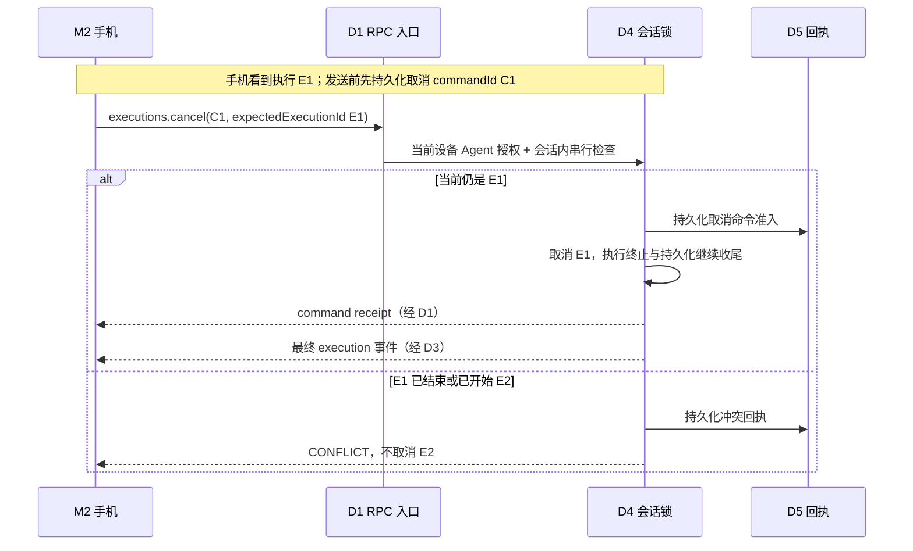
```mermaid
sequenceDiagram
    participant M as M2 手机
    participant G as D1 RPC 入口
    participant E as D4 会话锁
    participant D as D5 回执
    Note over M,E: 手机看到执行 E1；发送前先持久化取消 commandId C1
    M->>G: executions.cancel(C1, expectedExecutionId E1)
    G->>E: 当前设备 Agent 授权 + 会话内串行检查
    alt 当前仍是 E1
        E->>D: 持久化取消命令准入
        E->>E: 取消 E1，执行终止与持久化继续收尾
        E-->>M: command receipt（经 D1）
        E-->>M: 最终 execution 事件（经 D3）
    else E1 已结束或已开始 E2
        E->>D: 持久化冲突回执
        E-->>M: CONFLICT，不取消 E2
    end
```

**验收：** 关闭 RPC 等待、断开手机、取消执行是不同操作。
收到取消回执不应立即假定所有外部工具副作用都已停止。

## S11 Expiry and revocation

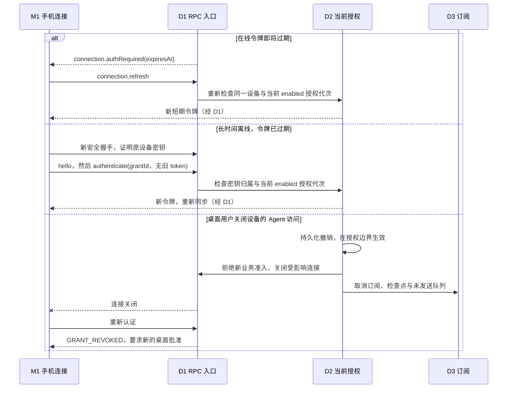
```mermaid
sequenceDiagram
    participant M as M1 手机连接
    participant G as D1 RPC 入口
    participant A as D2 当前授权
    participant J as D3 订阅
    alt 在线令牌即将过期
        G-->>M: connection.authRequired(expiresAt)
        M->>G: connection.refresh
        G->>A: 重新检查同一设备与当前 enabled 授权代次
        A-->>M: 新短期令牌（经 D1）
    else 长时间离线，令牌已过期
        M->>G: 新安全握手，证明原设备密钥
        M->>G: hello，然后 authenticate(grantId，无旧 token)
        G->>A: 检查密钥归属与当前 enabled 授权代次
        A-->>M: 新令牌，重新同步（经 D1）
    else 桌面用户关闭设备的 Agent 访问
        A->>A: 持久化撤销，在授权边界生效
        A->>G: 拒绝新业务准入、关闭受影响连接
        A->>J: 取消订阅、检查点与未发送队列
        G--xM: 连接关闭
        M->>G: 重新认证
        G-->>M: GRANT_REVOKED，要求新的桌面批准
    end
```

**验收：** 过期宽限期内只允许规定的 refresh/ping，撤销不能通过无 token 认证绕过。
撤销不能召回已送达的数据，也不默认取消之前已准入的桌面执行；执行取消仍由其所有者决定。

## S12 Backpressure

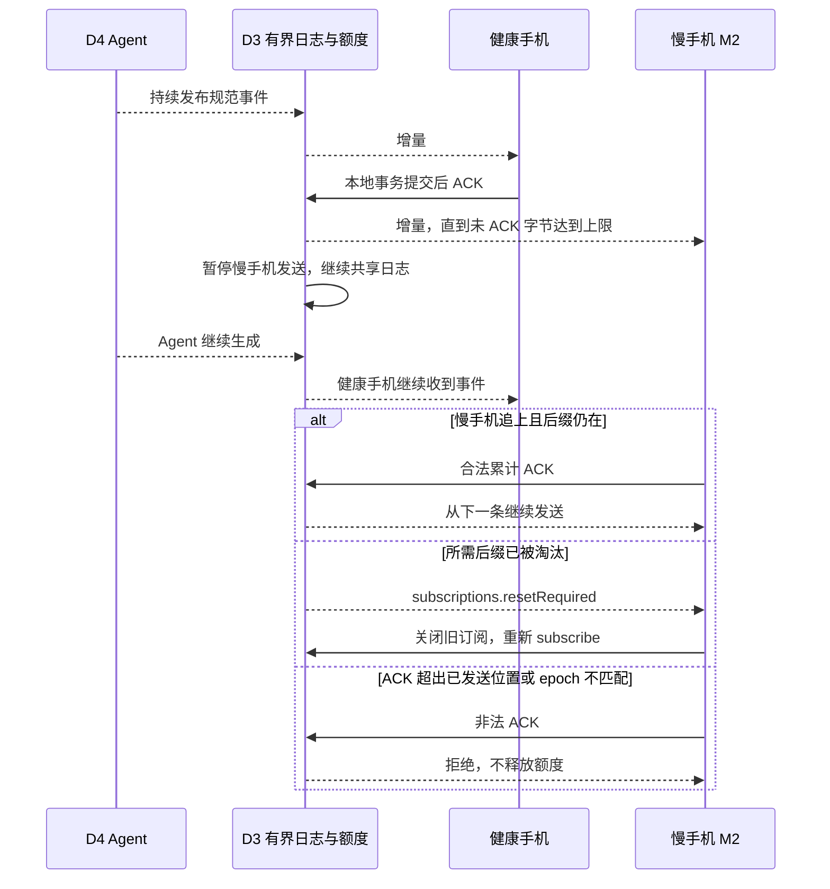
```mermaid
sequenceDiagram
    participant E as D4 Agent
    participant J as D3 有界日志与额度
    participant H as 健康手机
    participant S as 慢手机 M2
    E-->>J: 持续发布规范事件
    J-->>H: 增量
    H->>J: 本地事务提交后 ACK
    J-->>S: 增量，直到未 ACK 字节达到上限
    J->>J: 暂停慢手机发送，继续共享日志
    E-->>J: Agent 继续生成
    J-->>H: 健康手机继续收到事件
    alt 慢手机追上且后缀仍在
        S->>J: 合法累计 ACK
        J-->>S: 从下一条继续发送
    else 所需后缀已被淘汰
        J-->>S: subscriptions.resetRequired
        S->>J: 关闭旧订阅，重新 subscribe
    else ACK 超出已发送位置或 epoch 不匹配
        S->>J: 非法 ACK
        J-->>S: 拒绝，不释放额度
    end
```

**验收：** 控制请求不排在无界 bulk 队列后面；已经写入 TCP 的字节不能被取消请求超车。
无法送达 reset 通知时关闭该连接，不能无限保留客户端专属积压。

## S13 Relay interruption

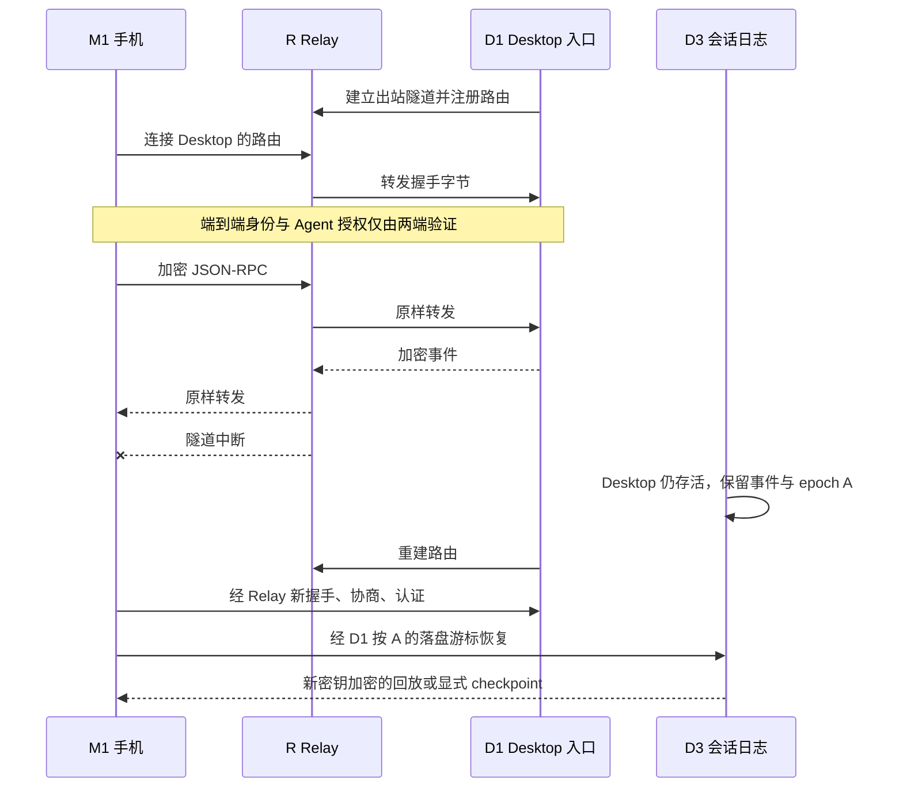
```mermaid
sequenceDiagram
    participant M as M1 手机
    participant R as R Relay
    participant G as D1 Desktop 入口
    participant J as D3 会话日志
    G->>R: 建立出站隧道并注册路由
    M->>R: 连接 Desktop 的路由
    R->>G: 转发握手字节
    Note over M,G: 端到端身份与 Agent 授权仅由两端验证
    M->>R: 加密 JSON-RPC
    R->>G: 原样转发
    G-->>R: 加密事件
    R-->>M: 原样转发
    R--xM: 隧道中断
    J->>J: Desktop 仍存活，保留事件与 epoch A
    G->>R: 重建路由
    M->>G: 经 Relay 新握手、协商、认证
    M->>J: 经 D1 按 A 的落盘游标恢复
    J-->>M: 新密钥加密的回放或显式 checkpoint
```

**验收：** 路由凭证不等于 Agent 权限；Relay 无需理解 JSON-RPC、设备授权或 seq。
隧道恢复不旋转会话 epoch，Desktop 状态丢失才触发对应重置。

## Implementation slices

| 实现批次 | 涉及模块 | 先跑通的场景 |
|---|---|---|
| 协议与本地夹具 | P、M1/D1 的内存 RPC 适配 | S02，以及标准 JSON-RPC 错误/通知/batch |
| 执行与数据基础 | D3、D4、D5、M2/M3 的测试实现 | S03、S04、S05、S07、S08、S12 |
| 安全 Desktop 入口 | D1、D2，成熟安全协议适配器 | S01、S09、S10、S11 |
| 真机单会话闭环 | M1、M2、M3、UI | S01 至 S12；包括网络切换与后台恢复 |
| Relay | R、M1/D1 reachability adapter | S13，不增加新的 Agent 方法集 |

这些场景应转为基于真实输入和结果的验收测试：验证不丢事件、不重复执行、旧审批不生效、
资源有界，而不是仅断言 mock 被调用。安全握手、跨端库兼容、性能预算仍需要实现验证。
