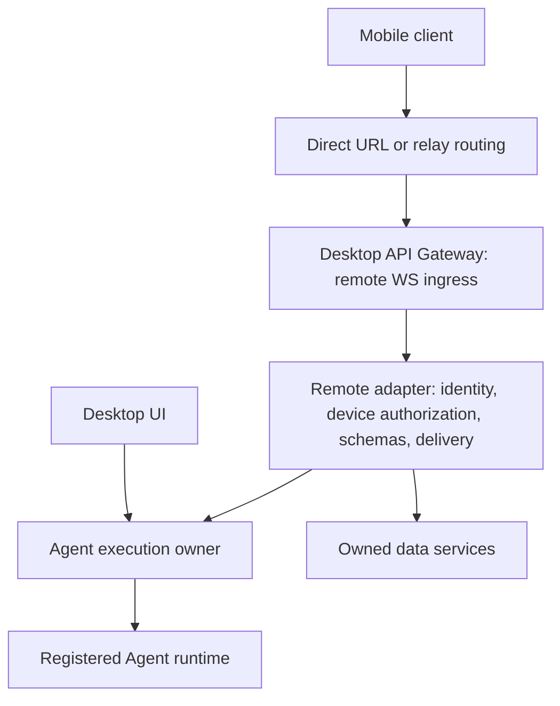

# Remote Agent Access (Design)

> **Status: target design; implementation coverage must be checked separately.**
> This replaces both the original raw-transport proposal in PR #16567 and the
> snapshot-based LAN contract in PR #20717. Compatibility with that unpublished
> implementation is not required. Existing code is a source of execution seams,
> not the specification. The [connectivity design](./remote-connectivity.md)
> records the current connection-layer baseline and its remaining gaps.

This document owns architecture, authorization, deployment, and package boundaries.
The [Remote Agent API Design](../ai/remote-agent-access.md) owns endpoint names,
DTOs, events, recovery, limits, and public package exports. Change these together;
do not maintain two independent method or event catalogs.
The [sequence diagrams and module map](../ai/remote-agent-sequences.md) trace these
contracts through pairing, execution, recovery, races, revocation, and backpressure.
The [implementation design](../ai/remote-agent-implementation.md) details proposed
package/Desktop files, function contracts, atomicity, and lifecycle ownership.
The [testing specification](../ai/remote-agent-testing.md) defines the real local
WebSocket client harness and acceptance gates for these stages.
The [connectivity design](./remote-connectivity.md) specifies identity-based
discovery, endpoint updates, VPN paths, reconnect ownership, and future relay ingress.
It records the current implementation baseline separately from these target contracts.

The original #20717 prototype was backed up and removed before the current
Noise/JSON-RPC implementation. The target contracts below are not a blanket
claim that every proposed service or owner extension has been implemented.

## Goal and decisions

A user's mobile app can read and drive an Agent running on their desktop: browse
Agent sessions, send messages, approve tools, and cancel an execution. The
Agent always executes in the desktop main process. The desktop must be online;
the cloud forwards encrypted bytes and never becomes an Agent execution fallback.

- **Full incremental transmission**, on LAN and over a relay. Text, reasoning,
  tool input, tool results, status, and approval changes all have explicit events.
  Checkpoints are for initial synchronization and recovery, not periodic refresh.
- **One protocol across reachability modes.** Direct LAN, a user's VPN/proxy,
  hosted relay, and self-hosted relay use the same encrypted WebSocket surface.
- **One public package: `@cherrystudio/remote-protocol`.** Its root is domain-neutral;
  Agent schemas and reducers live in its `/agent` export. Future domains do not
  require renaming the package or depending on Agent types.
- **Standard JSON-RPC 2.0 messages.** Requests/responses use `id`; server events
  are notifications. Numeric RPC errors and application reasons have separate
  meanings. Command deduplication, event replay and ACK remain application contracts.
- **Complete protocol versions, no feature negotiation in v1.** Incremental events,
  recovery, ACK and command receipts are mandatory parts of v1. Mobile and Desktop
  advertise implemented protocol versions and select a common complete version;
  incompatible releases stop with an upgrade message. Add capability negotiation
  only when a real optional feature requires it.
- **Small application-owned recovery layer.** Mobile controls connection generations,
  backoff, reauthentication and recovery; Desktop owns bounded replay and admission.
  Reuse WebSocket, JSON-RPC and crypto implementations. Do not introduce a separate
  realtime framework or generic reconnect SDK in the initial implementation.
- **One device-level Agent authorization switch.** Pairing proves identity; the
  desktop explicitly approves viewing and controlling its Agent sessions together.
  v1 has no per-resource allowlists or separate view/send/approve permissions.
  Approval does not bypass individual tool decisions or execution preconditions.
- **No automatic elevation** from an existing provider-pairing token, API key,
  Passport account, relay token, or network location to Agent authority.
- **Shared remote infrastructure:** provider/model configuration transfer and Agent
  access share pairing, device identity, authentication, encrypted WebSocket,
  JSON-RPC, reconnect and relay transport; see the decision below.
- **v1 scope:** own Expo / React Native client, provider/model configuration transfer, text submission, session creation,
  read-only history/artifacts, tool decisions, and conditional cancellation.
  Uploads, Agent configuration edits, arbitrary filesystem access, arbitrary
  network tunnels, business domains beyond configuration transfer and Agent access, and multi-user collaboration are out
  of scope. New domain modules require an actual consumer.

## Shared infrastructure for configuration transfer and Agent access

**Accepted product decision:** pair once and confirm the permitted capabilities
during that pairing. A successful pairing immediately enables the capabilities
the desktop approved; it must not require a second authorization step afterward.
Provider/model configuration transfer and Agent access use the same device identity,
key proof, authenticated encrypted WebSocket, JSON-RPC dispatch, connection recovery
and direct/relay reachability. Do not build another pairing or transport stack for
configuration transfer.

Business contracts and permissions remain separate. Configuration transfer belongs
to the provider/model data owners and may include credentials only when that
capability was approved. Agent access belongs to the existing execution/data owners;
its approval does not authorize credential export, and configuration-transfer
approval does not authorize Agent control. These are business permissions confirmed
at pairing, not optional protocol-feature negotiation or per-action Agent permissions.
Agent journals, checkpoints and execution receipts remain Agent-domain mechanisms;
configuration transfer does not have to adopt the streaming-session model.

Configuration transfer travels as business messages inside the same encrypted
remote route, including over a relay; the former HTTP provider-export route and
its bearer tokens have been removed rather than forwarded through that relay.

This decision expands the Agent-only contract draft below. Before freezing v1,
define the configuration-transfer method/DTO and package boundary, unified pairing
capability confirmation and authorization results, and the old HTTP path's migration
and retirement policy. The current `domain: 'agent'`, Agent-only authorization and
package examples describe the Agent slice, not the complete unified pairing contract.
This records the agreed direction; it does not claim configuration transfer has
already migrated or prescribe unreviewed wire names/token formats.

## Architecture and ownership

Reachability returns `{ baseUrl, routingCredential? }`. Identity pins, device keys,
and device authorization belong to the authenticated protocol; a routing credential only helps
bytes reach the correct desktop. Route names and encrypted payloads are identical
in direct and relay modes; see the [API surface](../ai/remote-agent-access.md#connection-and-api-surface).

| Owner | Responsibility | Boundary |
|---|---|---|
| API Gateway | HTTP upgrade, route isolation, connection admission | Does not execute Agents or grant access based on provider credentials |
| Remote adapter | Authentication, live authorization, DTO conversion, journal, delivery | Calls execution/data owners; never adds a second Agent loop |
| Agent execution owner | Stream listeners and state notifications, execution identity, send/cancel/approve serialization, final persistence | Must not import remote-access services |
| Data services | Durable command admission, device authorization state, session/history reads | SQLite changes remain in existing owning services and appended migrations |
| Mobile app | Connection lifecycle, secure keys, transactional local projection/cursor, UI | Consumes portable protocol schemas; no copied desktop internal types |
| Go relay | Desktop routing and bounded encrypted byte forwarding | No Agent schemas, plaintext history, tool arguments, or access-token validation |

Reuse the existing stream manager, runtime registry, persistence, and approval
owners. `addListener()` already registers a listener and synchronously replays its
buffer. The removed prototype supplied `observeTopic()` and snapshot access; any
replacement state/interaction observation hooks still need implementation.
Start from the existing listener mechanism, not a new session event model or capture API. Their
bounded execution buffers are not the remote journal, and renderer `WebContents`
attachment is not the remote adapter. Verify initial replay completeness, snapshot /
chunk handoff, attachment across executions, approval updates and persistence order;
extend the existing owner interfaces only where those tests expose a gap. Remote
owns protocol projection, checkpoint/replay barriers and ACK. Durable admission
still belongs with execution/data owners. Do not substitute periodic snapshot diffs
for streaming events. Long-lived resources follow the lifecycle framework.

## Decision: v1 synchronization scope (2026-09-21)

Desktop remains the sole authority. v1 provides current-execution deltas, bounded
replay, checkpoint recovery and command idempotency; it does not synchronize
independently editable replicas or merge client state. Completed, persisted
messages are history: changes invalidate history caches for on-demand reads,
rather than restarting message/part deltas on archived content.

Replay requires a complete local live baseline and a contiguous retained suffix.
Otherwise recover through a checkpoint, accepting extra transfer on that exceptional
path. Do not add message-level gap repair, historical-version hydration for appends,
or create/upsert events for cache reloads. Ordinary history scrolling does not
require a checkpoint. See the normative
[live/history boundary](../ai/remote-agent-access.md#v1-livehistory-boundary)
for completion, eviction and recovery rules. This boundary keeps weak-network
optimization focused on normal streaming and short disconnections.

## Defects this design removes

| Earlier approach | Failure | Target contract |
|---|---|---|
| Periodic full snapshots | Repeated transcript bytes grow with output; projection limits lose content | Ordered deltas; explicit complete content reads for referenced values |
| Forward internal transport types | Desktop refactors and SDK events become mobile breaking changes | Versioned public DTOs and adapters |
| Reconnect with a fresh event counter | Cannot distinguish gaps, duplicates, or a restarted desktop | Session epoch + sequence cursor; replay or explicit reset |
| Fetch snapshot then subscribe | Events can disappear between capture and attachment | Atomic checkpoint and replay barrier |
| Retry send after response loss | Can start duplicate execution | Durable command ID, canonical input, receipt and tombstone |
| Provider pairing implicitly authorizes Agent control | Provider credentials silently acquire unrelated authority | Separate desktop-approved Agent access switch on the paired device |
| Static-key-only encrypted channel | Long-term key compromise exposes recorded traffic | Reviewed authenticated ephemeral handshake with forward secrecy |
| Unbounded pending output | One slow phone consumes memory and delays controls | Byte credits, bounded journals/checkpoints, reset slow subscriptions |
| Public schema copies in both repos | Contract and reducers drift independently | One versioned package consumed by both |

## Reachability and route isolation

**Direct / BYO URL:** use the same surface through LAN, a VPN, or an existing
reverse proxy. LAN exposure is opt-in. The desktop validates deployment Host and
Origin policy in addition to cryptographic authentication; neither header is an
identity proof. Authentication and device-level authorization are required on LAN too.

**Relay:** one Go server/client codebase supports hosted and self-hosted operation.
The desktop initiates an outbound authenticated tunnel. Hosted reachability may
use Passport; self-hosting uses deployment credentials. A route ID identifies a
desktop tunnel, not an Agent session. Tunnel reconnection does not change device authorization
or replay cursors, unless desktop replay state was actually lost.

The remote ingress accepts only the remote WebSocket route. Enforce this allowlist
at the desktop, including when the route shares the existing gateway's listener;
relay configuration is not the security boundary. Do not forward `/v1/*`, provider
routes, local administrative routes, or an arbitrary target port. Existing local
OpenAI/Anthropic/MCP access remains a separate authorization.

The relay control plane has its own versioned registration, liveness, and routing
messages. Select its multiplexing implementation separately; those messages never
share Agent session IDs or parse encrypted business frames. Go binary acquisition
uses [Binary Manager](../binary-manager/README.md); secrets reach the child through
an inherited private pipe rather than command-line arguments. Relay queues and
connection admission must also be bounded.

## Pairing and device authorization

1. The desktop user enables sharing and creates a short-lived invitation. Its QR
   carries discovery, identity pin, invitation ID/secret and reachability, never a
   provider key or reusable Agent token.
2. The phone proves its key through the encrypted handshake and submits a claim
   for the Agent domain. There is no requested scope or permission checklist.
3. The desktop shows device identity, verification code and one explicit decision:
   allow this device to access and control desktop Agent sessions. Approval covers
   viewing, creation, sending, responding to individual tool approvals and cancelling,
   including future sessions. There is no remote approval or enable operation.
4. Approval binds the invitation, claim, device key and authorization generation.
   The phone receives a short-lived access token only inside its encrypted channel.
   Reject/expiry creates no authority; the same key may recover the same claim until
   its bounded expiry. QR possession alone is not permission to execute.

Store one optional Agent authorization on the existing paired-device record:
`agentRemoteAccess: null | { grantId, status: 'enabled' | 'revoked' }`, with the
proven device-key binding. Provider pairing remains independent and does not enable
this switch. There is no standalone remoteGrant table or RemoteGrantService, no
session/Agent/workspace allowlist, no grant revision and no per-action permissions.
Existing runtime/resource/lifecycle checks still apply; no provider secrets,
configuration editing or arbitrary filesystem API is added by this authorization.

`grantId` remains an opaque authorization-generation ID for tokens, command receipts
and recovery handles. It is not a permission object exposed for user management.
Initial approval and reapproval after revocation generate a fresh, never-reused ID;
refresh/reconnect or redundant enable preserves an already enabled generation.
Old pending commands cannot be automatically reassigned to a new generation.
A short-lived access token is audience-bound and bound to the device key and this
ID. Validate issuer/audience/expiry/algorithm using the selected reviewed profile,
and recheck the stored enabled generation on each request and outbound delivery.
Neither a token alone nor a grant ID proves the device key. Cryptographic and token
encoding choices remain release gates.

After token expiry while offline, the same approved key can authenticate the same
enabled generation to receive a new token. A revoked generation/key cannot refresh
or reactivate itself; it needs a new local approval. Protocol version compatibility remains a separate check; incremental delivery
and recovery are mandatory, with no per-feature flags in v1.

Revocation persists the disabled generation, closes its connections and invalidates
pages/checkpoints and queued delivery. Disabling Agent access leaves provider pairing
unchanged. Expiry pauses domain traffic until successful refresh. Identity rotation
requires pairing again. Backup restore revokes restored credentials/Agent authorization
before ingress resumes so rolled-back receipts cannot revive old authority. Audit
approval/revocation and command identities without logging credentials or tool input.
Read-only mode or restricted delegation can be designed when an actual use case needs
it; neither is part of v1.

## Encryption release gate

Select an established authenticated key-exchange protocol and maintained desktop /
Expo-compatible libraries before freezing protocol v1. The profile must provide:

- QR-pinned desktop authentication and device-key proof, including a distinct
  unapproved pairing state;
- fresh ephemeral keys, forward secrecy, key confirmation, and transcript binding
  of profile/version negotiation;
- authenticated encryption of requests, responses, events, history, pairing
  completion, and credentials, with directional keys/counters and replay rejection;
- explicit nonce/counter/rekey limits and OS-backed long-term key storage;
- independent test vectors, tamper/downgrade/replay tests, and actual Expo integration.

No business frame precedes handshake completion and device authorization. Disable
0-RTT mutations and plaintext/static-key fallback. Reconnect establishes fresh
keys; journal replay re-encrypts logical events rather than replaying ciphertext.
Public hops use WSS. LAN WS may carry the same authenticated encrypted channel;
it never carries plaintext business data. A TLS-terminating relay still sees only
application ciphertext, although it can observe size/timing and drop traffic.
This document intentionally does not invent a cipher frame or claim a reviewed
library/profile has already been selected.

## Public protocol package

Proposed location: `packages/remote-protocol`, published as
`@cherrystudio/remote-protocol`. Publication is a later delivery step, not part of
this documentation change. Both repositories install a tested package version;
a separate repository is not required.

| Export | Owns | Must not depend on |
|---|---|---|
| `@cherrystudio/remote-protocol` | JSON-RPC validation, connection/version negotiation, common errors, transport profile descriptors | Agent DTOs, other domain schemas, platform APIs |
| `@cherrystudio/remote-protocol/agent` | Agent method schemas, device authorization, events, checkpoints, pure reducer, canonical command encoding | Desktop services, mobile UI, other domains |

The dependency direction is domain → common, never common → Agent. Envelope
validation parses the common structure first; consumers compose only the domain
validators they support. Domain permissions remain in the domain export. Do not
pre-create task/file/sync domains or a universal business-event union.

Use runtime schemas as the single source for inferred request, result, error,
event, and checkpoint types. Export a typed method map as well as validators;
compile-time interfaces alone cannot validate a remote peer. Pure reducers and
canonical command encoding must have shared conformance fixtures. The concrete
[export surface](../ai/remote-agent-access.md#public-package-api) lives in the API design.

Use an existing portable JSON-RPC implementation for dispatch and request correlation
in platform adapters. Evaluate [json-rpc-2.0](https://github.com/shogowada/json-rpc-2.0)
first with the packed-package Node/Expo proof; this is a candidate, not a dependency
already added or a completed compatibility test. Verify batch/error/notification
behavior, pending-request cleanup, transport send failures, and bounded admission
before choosing it. Keep its concrete client/server objects out of the package's
public domain API. Do not implement another RPC engine or adopt a Node stdio framing
stack merely to share method types.

No Electron, React, React Native, database, provider SDK, Node-only `Buffer` /
crypto/fs, sockets, timers, or mutable singleton state belongs in the package.
Use JSON-compatible DTOs and `Uint8Array` at byte boundaries. Keep cryptographic
implementations, platform key storage, networking/reconnect, and UI in their
adapters; the package declares the selected profile and protocol shapes only.
Do not re-export `@shared/ai/transport`, `UIMessageChunk`, or internal persistence
models. The App's `packages/universal` can temporarily re-export these canonical
contracts while consumers migrate; it must not retain another schema implementation.

Publish compiled JavaScript, declarations, explicit export paths, and conformance
fixtures. Validate the actual packed artifact in Node and Expo/Metro. Start with
prereleases until both consumers interoperate. Package semver, app releases and
protocolVersion are separate. Compatible optional response fields may be additive;
new methods/event variants or changed reducer/command-identity semantics need a new
protocol version. v1 has no capability negotiation or separate domain-version axis.
Select the highest common explicitly implemented version; a newer app can retain an
older complete protocol to interoperate with an older peer. Test every advertised
version against actual released peer artifacts, not just the latest code relabeled
with an old version. Do not promise automatic N-1 compatibility. See the
[compatibility rules](../ai/remote-agent-access.md#protocol-version-compatibility). Generate cross-language schema artifacts only
when a real consumer needs them. The Go relay does not need Agent schemas.

## Application-protocol references

These references guide specific responsibilities; sharing their patterns does not
claim ACP, LSP, JMAP, or NETCONF wire compatibility.

| Reference | Applied decision | Boundary |
|---|---|---|
| [JSON-RPC 2.0](https://www.jsonrpc.org/specification) | Standard request/response/notification, numeric errors, batch semantics | Does not supply authorization, command idempotency, or replay |
| [ACP v1 initialization](https://agentclientprotocol.com/protocol/v1/initialization) and [prompt turn](https://agentclientprotocol.com/protocol/v1/prompt-turn) | Review session, prompt, output and permission semantics before inventing domain concepts | Phone does not become the executor's filesystem/tool host; approval must survive disconnect |
| [LSP initialization](https://github.com/microsoft/language-server-protocol/blob/gh-pages/_specifications/lsp/3.17/general/initialize.md) | Initialization before independently released peers exchange business messages | Reference only; v1 does not adopt its capability negotiation |
| [JMAP RFC 8620 §5.2](https://www.rfc-editor.org/rfc/rfc8620.html#section-5.2) | State-based incremental recovery with explicit inability to calculate changes | Record synchronization is not token replay; our event journal and ACK contract are additional |
| [NETCONF RFC 6241 §8.1](https://www.rfc-editor.org/rfc/rfc6241#section-8.1) | Explicitly advertised common protocol version | Reference only; v1 does not adopt extension capabilities, XML, or network configuration operations |

## Implementation order and acceptance

This is a staged rewrite plan. Complete each acceptance gate before enabling its
network behavior; documentation changes alone do not satisfy a stage. The first
deliverable is the protocol package and a two-consumer conformance proof, followed
by a single real desktop/mobile Agent flow before expanding the UI or adding Relay.

### Baseline integration points and archived references

The baseline desktop provides execution and data owners, but not the target
contract. The removed `remoteAccess` files and `RemoteCommandService` below refer
to the archived #20717 prototype and must be implemented anew. The App paths below are relative to the linked mobile repository and
describe its current workspace layout; recheck them against the implementation base.

| Baseline location / archived prototype | Reuse or change |
|---|---|
| Desktop `src/main/services/remoteAccess/protocol.ts`, `requestRouter.ts` | Replace custom `type/requestId` envelopes and local method schemas with JSON-RPC dispatch and imported package contracts |
| Desktop `RemoteAgentSubscription.ts`, `messageProjection.ts` in that service | Replace timed snapshots and per-subscription epochs with immutable per-session/protocol-version events, checkpoint barriers, shared replay and byte credits |
| Desktop `src/main/ai/streamManager/AiStreamManager.ts`, Agent lifecycle/runtime owners | Reuse StreamListener, addListener and per-topic locks; add required state observation; verify replay/attachment gaps and extend existing owners only as needed; add idle reservation |
| Desktop `src/main/data/services/RemoteCommandService.ts`, remote `agentCommands.ts` | Implement transaction-backed receipts with device/authorization-generation identity, durable admission outcomes/tombstones, and explicit crash recovery |
| Desktop gateway and paired-device services | Reuse listener/lifecycle/device identity ownership; add isolated WS routing and the device-level Agent switch; replace the static-key channel only after crypto validation |
| App `packages/universal` | Keep existing portable app contracts; consume the published remote package rather than copying network schemas into this package |
| App `src/backend/services`, `src/backend/data` | Own remote connection/key lifecycle and transactional projection/cursor/pending-command storage respectively |
| App `src/shared/contracts`, `src/bootstrap/composition/createBackend.ts` | Expose and assemble a semantic remote workflow; these in-process interfaces must not expose RPC IDs, sockets or raw wire envelopes |

Changes to persisted device authorizations, command identities or stable part IDs require appended
migrations with populated-database forward tests. Do not rewrite existing migrations.
The existing App `ChatModule` drives a local runtime; remote execution must not
silently enter that executor or create a second local run.

### Stage 1: package and JSON-RPC conformance

- Create `packages/remote-protocol` with explicit root and `/agent` exports. Define
  canonical schemas/method maps, application error reasons, negotiation, event
  reducer/checkpoint installation, and shared wire fixtures. Separate RPC correlation
  from durable `commandId` in examples and types.
- Validate the candidate RPC library with paired in-memory endpoints, then install
  the same packed artifact in Node and the actual Expo/Metro environment. Keep this
  harness transport-only; it does not publish an insecure network mode.
- Verify standard errors, null/number/string response IDs, no response to notifications,
  mixed/empty batches, response reordering, quota enforcement and pending-call cleanup.
  Verify different Mobile/Desktop releases sharing one complete version, future
  new/old peers in both directions, no common version, and client rejection of an
  unoffered selection. Do not introduce capability flags or partial-v1 modes. Unknown domain notifications never
  advance a projection cursor.
- Deliverable: a portable package artifact and passing independent consumer fixtures.
  Use a local packed artifact first; registry prerelease publication is a separate
  delivery action after package contents and consumers are validated.

### Stage 2: execution and persistence correctness

- Build the remote adapter on existing StreamListener/addListener and topic/runtime
  observations. Test complete/truncated replay, an idle session starting a run,
  subsequent executions, snapshot/chunk handoff, approvals and final persistence.
  Extend existing owners only for demonstrated gaps; do not pre-create a generic
  session event model or new capture API. Build the bounded remote journal from
  these sources, not periodic full-snapshot diffs. Preserve stable identities and
  test runtime-specific mappings, including tool input/output.
- Extend durable admission through the existing topic lock and synchronous database
  transaction. Add device/authorization-generation deduplication and retain terminal tombstones. Existing
  local and remote entry points must honor the same execution reservation.
- Verify no missing event at capture/subscribe, complete Unicode/tool reconstruction,
  epoch/reset handling, lost admission response, changed-input retry, activation
  failure and restart after uncertain side effects. Use real migrated test databases.
- Deliverable: correct owner-level behavior with a deterministic fake transport;
  no mobile screen or network reachability is required to prove these invariants.

### Stage 3: authenticated desktop gateway

- Select and validate the desktop/Expo crypto and token profile. Implement pinned
  identity, device-key proof, explicit desktop approval, device authorization revocation and token
  renewal; verify the reviewed protocol's interoperability and negative vectors.
- Mount `/v1/remote/connect` with its own admission/auth boundary, outside the
  gateway's provider-key guard while still covered by the remote route allowlist.
  Register resources with lifecycle ownership. Wire the JSON-RPC adapter to Stage 2.
- Verify that old provider/device credentials alone cannot invoke Agent methods,
  that revocation stops pending delivery, and that send/approve/cancel each enforce
  the enabled device authorization and concurrency preconditions. Validate full encrypted Node↔Expo
  round trips before exposing this mode to users.
- Deliverable: a secure direct endpoint exercised by a protocol client. The
  cryptographic profile is a prerequisite, not an optional post-launch hardening task.

### Stage 4: one complete mobile flow

- Add a backend remote workflow under the existing mobile service bucket. It owns
  secure key storage, JSON-RPC connection/negotiation, subscriptions, timeouts and
  reconnect. Put durable pending commands and projection/cursor writes behind the
  mobile data owner. UI consumes semantic states and operations through its normal
  workflow seam, never through raw `request(method, params)` calls.
- Complete pair → select permitted session → install checkpoint → send → render
  text/tool updates → approve/cancel → durable completion. Include read-only history
  and content paging where required to view the session and complete approval input.
- Verify iOS/Android background/resume, app restart, lost receipt, token expiry,
  version mismatch and revoked device authorizations. Network timeout shows an unknown/pending
  command outcome until reconciled; it never silently resends under a new ID.
- Deliverable: one real Agent session works end to end, including reconnect, without
  starting a local mobile Agent or copying credentials to run the model there.

### Stage 5: weak-network acceptance and rollout

- Exercise replay/checkpoint expiry, gaps/duplicates, ACK validation, byte quotas,
  slow subscribers and control-message scheduling under injected latency, bandwidth
  limits and disconnections. Add golden event traces covering all supported runtimes.
- Compare total wire bytes, first-text latency, recovery time, queue/journal memory
  and cancel-response delay on identical traces. Streaming appends must send new
  content plus bounded framing, not growing transcript snapshots. A slow subscriber
  cannot block desktop execution or healthy subscribers.
- Run compatibility tests across every advertised released package/protocol-version pair.
  Only then freeze budgets, publish the validated package and enable the replacement
  remote mode; remove obsolete snapshot/parser paths as part of that cutover.

### Stage 6: relay reachability

Add hosted/self-hosted routing with the same encrypted JSON-RPC and Agent semantics.
Test tunnel reconnect without epoch changes when desktop state survives, desktop
route isolation, bounded relay queues, and absence of plaintext business payloads
at the relay. No Relay-specific Agent method set or second protocol package is needed.

Required cases include Unicode boundaries, interleaved tools, replacement content,
multiple executions, missing/duplicate events, epoch reset, checkpoint expiry,
client crash between projection/cursor writes, desktop crash before persistence,
response loss after admission, same-ID input conflict, concurrent local/remote
approval, stale cancellation, token expiry/device revocation during replay, and invalid
handshake/oversized input. Byte budgets in the API design are proposed defaults;
measure first-text latency, catch-up time, memory and control-response delay on real
mobile networks before freezing them. The bounded journal is not durable event
sourcing and cannot promise recovery of unpersisted output after a desktop crash.

## Related references

- [Remote Agent API Design](../ai/remote-agent-access.md) — authoritative target wire and package API.
- [API Gateway Reference](./README.md) — current implementation.
- [AI Reference](../ai/README.md) — execution, stream listeners, persistence, and approval ownership.
- [Lifecycle](../lifecycle/README.md) — resource ownership and shutdown.
