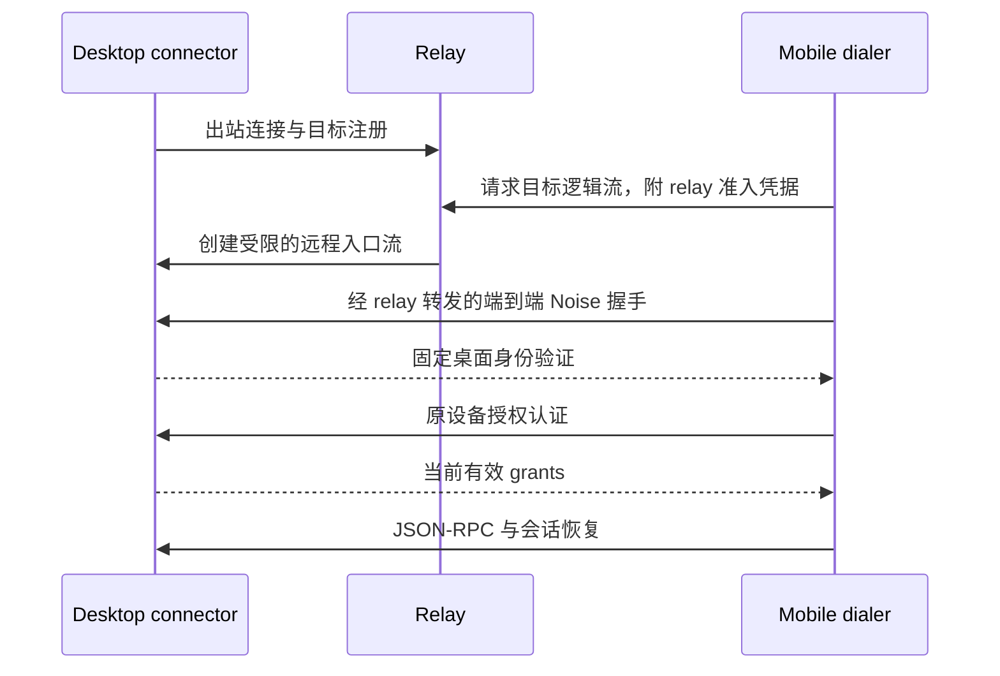

# Remote Connectivity Design

> 状态：首期代码已实现，2026-09-23；真机网络与权限验收另行记录。下文保留完整设计，首期实施边界见下节。
> 本期目标是更换网络地址后自动恢复同一台已配对桌面的访问。后续 relay 只预留必要边界，不在本期实现。
> 已确认的简化决策：持久保存配对关系和用户显式配置；自动发现地址、扫码位置提示和最近成功端点只保存在内存。

本文负责身份与寻址分离、发现、拨号、访问路径策略及两端 ownership，是
[远程访问架构](./remote-agent-access.md)的连接层补充。
[Agent API](../ai/remote-agent-access.md)继续负责业务 RPC、事件、checkpoint 与命令回执；本文不复制或改变这些业务契约。
[API Gateway](./README.md)继续负责本机 HTTP 服务与直接 WebSocket 入口。

## 首期实施边界

- 桌面 `RemoteAdvertisement` 使用现有 Bonjour 库发布 `_cherry-remote._tcp`；TXT 仅公开身份与发现版本，
  SRV 使用 Gateway 的实际共享端口，仅发布当前 IPv4 listener 能接入的地址。Gateway 将真实入口状态推给远程 owner，没有反向 lifecycle 依赖。
- 局域网访问统一控制连接入口与发现发布，不提供独立的发现开关。仅本机临时 API 租约不会
  打开发现。发布组件检查网卡变化，并在恢复唤醒时刷新；停机撤销异步发布意图。发现失败只显示状态提示。
- 移动端使用单个 Expo 原生发现模块和内存 Resolver；Manager 串行尝试候选，每轮最多 15 秒，socket
  打开最多 4 秒，后续握手与认证最多 6 秒。不实施后文的并发竞争拨号或 RemoteDialer 包装层。
- 用户配置最多 8 条；自动与 QR 候选最多 16 条。QR 5 分钟失效，发现的本地重验预算 60 秒。
  用户域名保留至拨号时由系统解析。换网取消旧拨号，健康连接保持，业务 scope 和 grants 不变。
- 移动端 schema 新增 `configured_endpoints`；直接删除不再使用的旧 IP/port 列，不重建父表、不复制为
  用户配置。设置提供地址编辑及独立的位置扫码；首次配对把 QR 提示交接至新 connectionId。
- 错误 Noise 身份仅导致候选失败；只有固定身份桌面的 authenticate 拒绝才能标记需要重新授权。
  发现不可用和找不到地址会给出设置地址或扫码的操作提示。
- 原生模块需要随新移动客户端发布。Android 34+ 订阅服务变化；旧版串行解析并丢弃取消后晚到的结果。
  旧 Android 已进入系统的解析无法取消，后续重试可能等待系统释放；手动地址不依赖发现。
- 本期不改变桌面 Keychain 存储和签名，不新增 relay、目录、VPN SDK 或后台常驻发现。

## 1. 问题与改动前实现


移动端配对时把二维码中的 IP 列表、端口和桌面密钥身份一起保存；之后的重连反复尝试原地址。
当电脑从一个 Wi-Fi 切换到另一个 Wi-Fi，或 DHCP 分配了新地址时，密钥和授权仍然有效，但手机无法找到桌面。
要求用户重新配对才能更新地址，把可变的网络位置错误地绑定到了长期信任关系。

本次排查中，手机持续打开旧地址 `192.168.1.102:23335` 并超时；电脑当前地址为 `192.168.71.127`。
在电脑本机探测，新地址的远程路径返回 WebSocket `101`，旧地址未完成升级。
这证明了当次连接没有走到正确地址，不代表手机经新地址完成了 Noise、授权或 Agent 端到端验收。

2026-09-23 的源码基线：

| 位置 | 已有行为 | 缺口 |
|---|---|---|
| Desktop `ApiGatewayService.getLanEndpoint()` | 创建邀请时读取当前 IPv4 地址和实际端口 | 没有持续发布和地址更新机制 |
| Desktop `RemoteAccessService` | 持有身份、配对、连接注册表，接收 WebSocket | 接入方式和 LAN 开关直接耦合 |
| Mobile `DesktopConnectionRuntime.pair()` | 保存成功地址与二维码中的其他地址 | 地址刷新依赖配对流程 |
| Mobile `DesktopConnectionManager` | 唯一租约、前后台和重连 owner | 每轮重连使用旧地址列表，没有网络变化来源 |
| Mobile `DesktopSession.connect()` | 逐个拨号，完成 Noise 和 hello | 寻址、候选选择和单连接职责混合 |
| Shared `connectSecureChannel()` | 在 `MessageStream` 上建立 Noise 会话 | 已有可复用的传输分离点 |

移动端源码在配套 cherry-studio-app 仓库，以上路径相对于其 `src/backend/services/desktopConnections/`。
桌面已有 `bonjour-service` 依赖，当前被文件传输模块使用；远程访问不应依赖文件传输服务的生命周期。

## 2. 范围与不变量

本期实现 LAN DNS-SD/mDNS 发现、已配置域名/IP 的直接连接、内存候选管理、错误分类和重连恢复。
支持用户已安装并运行的 Tailscale/ZeroTier 所提供的网络；不内嵌 VPN SDK，不接管其账号或网络管理。
不实现公网目录、relay 服务、NAT 穿透、跨网段 multicast 转发或无缝迁移现有 socket。

必须保持：

1. 配对绑定桌面密钥身份及手机授权；IP、端口、域名和 relay 位置都不是身份。
2. 自动发现是非可信输入。只有 Noise 验证通过的桌面能确认设备授权。
3. 网络变化不能自动替换桌面密钥、清空授权、创建新配对或重置会话 scope。
4. 每台桌面在一个移动端 host 中最多安装一个活动的业务连接；所有 domain 共用它。
5. Agent、配置同步、MCP、文档导出和前端业务组件不选择网络路径、不管理 socket、不独立重连。
6. 网关普通 HTTP/MCP 路由继续保持原有访问边界；发现和 relay 不增加通用代理入口。
7. 本期新增发现失败不能使原本可用的直接连接失败；权限被拒绝也不能被当作配对失效。
8. 所有探索、拨号、握手与后台任务有预算、取消和清理语义。

## 3. 分层与依赖方向

```mermaid
flowchart TD
  UI[前端会话与设置] --> DOM[Agent / 配置同步 domain]
  DOM --> MAN[DesktopConnectionManager 租约与重连]
  MAN --> RES[DesktopEndpointResolver 候选路径]
  RECENT[本次运行的有效候选与成功端点] --> RES
  NSD[平台 DNS-SD 发现] --> RES
  CFG[配置的域名或 IP] --> RES
  DIR[未来在线目录] -.-> RES
  MAN --> DIAL[RemoteDialer]
  DIAL --> DIRECT[直接 WebSocket]
  DIAL -.-> RELAY[未来 relay 隧道]
  DIRECT --> SESSION[DesktopSession: Noise / 授权 / JSON-RPC]
  RELAY -.-> SESSION
  SESSION --> RESTORE[已有事件与命令恢复]
```



发现来源和传输方式是两个轴。mDNS 产生直接连接候选；VPN 域名也产生直接连接候选；目录将来可以同时返回直接和 relay 候选。
不要定义互斥的 `mdns | tailscale | relay` 连接模式，把服务发现、VPN 和传输混为一谈。

| Owner | 职责 | 不负责 |
|---|---|---|
| Desktop `ApiGatewayService` | 实际 listener 状态、直接入口开关、端口事件 | Bonjour 记录内容、Agent 恢复 |
| Desktop `RemoteAccessService` | 远程身份、入口准入、连接池、配对与授权；持有发布组件 | 网卡扫描算法、前端连接判断 |
| Desktop `RemoteAdvertisement` | 远程服务发布、更新、撤销和清理 | 授权、独立 listener、文件传输 |
| Mobile 原生发现适配器 | 平台服务发现/解析、网络变化、能力与权限结果 | 配对、重试策略、业务状态 |
| Mobile `DesktopEndpointResolver` | 聚合候选、去重、有效期和网络代际 | 建立连接、授予信任 |
| Mobile `RemoteDialer` | 按路径打开可取消的传输流 | Noise 身份决定、业务重试 |
| Mobile `DesktopSession` | 一个流上的安全会话、RPC、心跳和令牌刷新 | 多地址循环、发现、AppState |
| Mobile `DesktopConnectionManager` | 单连接竞争、租约、前后台、退避、授权安装 | 业务投影、平台发现细节 |
| Mobile domain runtime | 通过原有租约恢复订阅、投影、命令回执 | 识别 LAN/VPN/relay |

长寿命 owner 使用各仓库既有 lifecycle 系统。`RemoteAdvertisement` 是 `RemoteAccessService` 持有并 dispose 的组件，
不另建全局 singleton。移动端发现适配器被连接模块组合根持有，不让 resolver 再成为第二个 AppState owner。
若后续确有多个产品消费者，再提取共享发现底层；本期仅复用 Bonjour 依赖。

## 4. 身份与持久化模型

### 4.1 配对关系

保留现有 `connectionId`、`desktopIdentity`、`deviceId`、domain grants 及 identity-bound scope。
持久对象表达“已配对设备”；`connectionId` 是历史、草稿与恢复记录的稳定关联键，不表示永久存在的 socket。
连接、连接状态与发现结果属于运行资源，冷启动时从配对关系和用户配置重新建立。
地址变更不能调用设备替换/invalidate 流程，也不能产生新的 command journal 分区。
桌面身份按持久化应用实例定义，不能用主机名、机器 MAC、工作区目录或 IP 代替。
同一台电脑上使用独立应用数据目录的实例有独立身份；共享身份文件的进程不能被发现层假装成不同设备。

### 4.2 用户配置与临时位置

本期不实现持久端点缓存。它只可能减少启动时的发现等待，不能解决地址变化，却需要额外的过期、淘汰和迁移机制。
先验证按需发现的实际体验；只有测出明确收益后，才单独评审是否增加持久缓存。

| 数据 | 保存方式与生命周期 | 可信度 |
|---|---|---|
| 用户显式配置的 hostname/IP + port | 持久保存，用户修改或删除前保留 | 连接意图，仍需 Noise 验证 |
| 配对或更新位置 QR 的地址 | 仅作本次运行的内存提示，受有效期和网络代际限制 | 地址可能陈旧，不因扫码就获得业务授权 |
| NSD 解析结果 | 仅内存，受服务状态、TTL 和本地预算限制 | 未验证候选 |
| 本次运行中最近成功端点 | 仅内存，用于短时重连排序，失效或退出后丢弃 | 重连仍需再次验证身份 |
| WebSocket、连接状态和失败统计 | 运行期内存，不随重启恢复为 ready | 不代表长期配对状态 |
| 未来 relay 服务配置 | 只保存必要的用户配置；临时路由和隧道不持久化 | 不等同于业务授权 |

用户配置的域名保留域名本身，其 DNS 解析结果不作为永久 IP 保存。
扫描或自动发现不得隐式创建用户配置；若用户需要固定地址，必须通过明确的保存配置操作表达。
relay 凭据由未来方案按其安全存储规则管理，不混入端点缓存。

### 4.3 既有安装迁移

保留现有配对行、密钥、deviceId、grants、connectionId 和业务恢复记录，不创建持久 legacy 端点提示表。
新连接逻辑停止从旧 `addresses[] + port` 加载候选，也不再写入发现或成功地址；不能把旧 QR 地址自动转换为用户配置。
旧字段可在兼容过渡期保留历史值，但不再参与新逻辑，最终通过正式追加迁移移除，不能修改已发布迁移。
新配对写入不应要求有效的持久地址，实施时通过兼容的 schema 迁移处理旧字段约束。
只为用户显式配置增加必要的存储结构；配对授权状态继续持久化，运行连接状态不作为跨重启事实。

升级后通过发现重新找到旧设备；老 desktop 尚未发布服务时，用户可输入地址或扫描位置提示，仍使用原授权，不需重新配对。
应用重启清空临时地址，已配对设备列表仍然存在；发现被阻断且无用户配置时明确呈现不可达，不偷偷恢复旧地址依赖。
回滚版本仍可能使用冻结的旧字段，不能承诺它获得新发现能力；迁移验证必须覆盖配对关系完整性，而非回写临时地址来维持旧逻辑。
“忘记设备”才删除配对及关联配置；清理内存候选不能删除信任关系。

## 5. 连接消费契约

以下为目标契约示意，不是已经导出的公共 API。字段最终命名遵循各仓库规则。
本期只实现直接路径；relay 分支用于说明边界，不提前提交空实现或未使用的 registry。

```ts
type DirectRoute = {
  kind: 'direct'
  host: string
  port: number
  security: 'ws' | 'wss'
}

type RelayRoute = {
  kind: 'relay'
  relayOrigin: string
  targetRef: string
}

type RouteCandidate = {
  candidateId: string
  networkGeneration: number
  source: 'configured' | 'discovery' | 'invitation' | 'directory'
  expiresAt?: number
  route: DirectRoute | RelayRoute
}

type ResolutionEvent =
  | { type: 'upsert'; candidate: RouteCandidate }
  | { type: 'remove'; candidateId: string }
  | { type: 'status'; source: RouteCandidate['source']; state: 'searching' | 'unavailable' | 'permission-denied' }

interface EndpointResolver {
  watch(target: PairedDesktopTarget, signal: AbortSignal): AsyncIterable<ResolutionEvent>
}

interface RemoteDialer {
  open(candidate: RouteCandidate, signal: AbortSignal): Promise<OpenedTransport>
}

interface OpenedTransport {
  stream: MessageStream
  close(): Promise<void>
}
```

`PairedDesktopTarget` 是只读的预期身份与用户配置，不包含私钥或持久发现结果；`MessageStream` 沿用 transport 包所需的流契约，
不再自造一套流协议。`DesktopSession` 接收打开的流、预期桌面身份、手机身份和取消信号。
本期提取其 WebSocket 打开逻辑到 dialer，保留 transport 包现有 Noise 握手。
QR 地址通过本次操作传入 resolver 的临时提示入口；最近成功候选保留其原始 source，验证结果只影响内存排序。

契约规则：

- resolver 只报告候选变化；单个来源失败不终止其他来源，平台错误必须可区分权限、不可用和未发现。
- `AbortSignal` 终止 browse/resolve；退出 async iterator 也必须解除引用并清理。
- 平台适配器向上报告服务增删/更新；resolver 负责多消费者引用计数，多个桌面不重复启动全网浏览。
- 地址与端口属于每个 route，不再让所有地址共享不可变的一个端口。
- 拨号成功只代表传输打开；只有身份与授权认证完成后才能更新内存成功标记，不写入持久地址。
- route 不携带长期秘密。未来 relay 凭据由专属安全存储/凭据提供器按需取得，不落入日志和前端 DTO。
- host、端口及协议严格校验；路径固定为远程升级路径，禁止 URL userinfo、任意 HTTP 路径或任意代理目标。
- 支持普通域名、IPv4 和可用的 IPv6。IPv6 link-local 必须保留接口作用域；平台或 RN 无法表达时明确跳过，不能生成无效 URL。
- 候选元数据、队列和 TTL 都有上限；外部记录声明的 TTL 不能无限延长本地预算。

## 6. DNS-SD 发布与发现

### 6.1 桌面发布

拟使用 `_cherry-remote._tcp` 作为服务类型；正式发布前确认冲突与服务名注册要求。
SRV 描述实际主机与端口，地址来自解析结果，TXT 仅包含发现记录版本和桌面身份指纹提示。
发现记录版本与 Noise/JSON-RPC 协议版本独立，TXT 不能替代安全握手中的版本协商。

服务 instance name 使用不含用户名的实例标签；服务名发生冲突后的重命名不影响密钥身份。
指纹是候选筛选提示，不是授权；不广播配对邀请秘密、设备授权、relay 票据、会话名或供应商配置。
稳定指纹仍具有局域网可关联性，本期接受在显式开启发现时暴露这一标识；隐私增强的轮换发现标识属于后续设计。

发布条件是 listener 实际就绪、直接远程访问开启且发现开启，不能只看保存的 preference。
监听端口变化、网卡变化和唤醒后协调更新/重新发布；关闭局域网访问时同时撤销广告并关闭直接连接入口。
服务撤销通知只是提示，不保证所有客户端立即收到，移动端仍需有效期和身份验证。
发布失败可降级为已配置地址连接，不应停止网关普通 HTTP 服务。

先审查现有 `bonjour-service` 的多网卡与地址更新能力。接口不满足时再补适配或选库，不先写原始 mDNS 实现。
避免把所有虚拟网卡地址都当成优先 LAN 地址；不基于 RFC1918 与否推断身份或授权。

### 6.2 手机发现与权限

Android 使用系统 NSD；Apple 平台使用 Bonjour 的受支持 API。优先审查可维护且兼容当前 Expo/RN 的封装，
没有满足取消、服务更新、多接口与错误语义的库时，再在本地 Expo module 中封装原生 API。
本期不要在 JS 中自行发送 UDP multicast 包。

按目标 OS/SDK 配置局域网权限及 Bonjour 服务声明，在用户使用设备连接功能时触发需要的系统授权。
不能假定 Android 各版本权限相同；实施时按当前 target SDK 和支持的 OS 建立权限矩阵。
拒绝权限单独呈现，不清空配对、不无限重试权限请求；显式地址连接是否可用也取决于平台局域网权限。

网络事件表示接口/路径变化，不用“能访问互联网”作为 LAN 可用条件，也不把 SSID 当作设备身份。
前台且有连接需求时发现；全部连接稳定后允许停止活跃浏览，需要恢复或新消费者出现时再启动。
内存候选遵循有效期，退出应用后不保留；冷启动重新发现。未发现服务与没有权限是不同结果。

## 7. 调度、连接代际与失败处理

### 7.1 重连算法

1. 保留现有 domain 租约，创建连接尝试代际与取消信号；从用户配置和按需发现获得候选。本次运行存在仍有效的成功候选时可优先尝试，冷启动不读取历史发现地址。
2. 新候选到达即可参与拨号，不先等全部旧 IP 超时。首版候选并发建议最多 2 个，使用有界延迟错峰尝试。
3. 每个候选有打开和安全握手预算，一轮恢复也有总预算。继承现有预算作为起点，数值经设备测量后确定。
4. 候选完成 Noise 固定身份校验后才进入授权阶段。选择一个候选串行完成设备认证，其他候选不发送业务命令。
5. 在安装连接前再次核对 host 生命周期、连接代际、配对身份和租约需求；过期结果只能关闭，不能覆盖新连接。
6. 成功后仅更新内存中的最近验证端点，取消并关闭其他候选，重置退避，再通知 domain 恢复；不把成功地址写回配对记录。
7. 暂时无法连接时保留配对和未完成操作，使用有上限且带 jitter 的退避；新网络或新候选可提前触发下一轮。

没有活跃租约时不后台永久扫描。释放最后一个租约后按现有 idle grace 清理。
网卡变化令旧网络上的候选结果失效，但不必立即断开仍健康的连接；同一稳定连接不因“发现了优先级更高的地址”反复切换。
服务 lost 事件淘汰地址提示，不等于授权撤销，也不能单独成为关闭健康 socket 的依据。
后台策略继续由 manager 统一处理：取消发现和拨号、关闭当前会话并标记 suspended；回前台重新解析后恢复。

### 7.2 错误分类

| 错误 | 作用范围 | 配对是否改变 |
|---|---|---|
| 打开超时、拒绝连接、DNS 不可解析 | 淘汰/降级当前候选，继续解析 | 否 |
| 候选 Noise 身份不符 | 拒绝候选并记录受限诊断，继续找预期身份 | 否，不能自动信任对方 |
| 未认证的版本响应或广播声称不兼容 | 候选级失败，不污染设备授权 | 否 |
| 完成固定身份校验后确认版本不兼容 | 呈现需要升级的状态 | 否 |
| 原桌面认证明确表示手机身份未获授权 | 终止自动业务恢复，提示重新授权 | 标记授权待恢复 |
| 某 domain grant 被撤销 | 只退休相应租约 | 其他 domain 不受影响 |
| 系统网络权限拒绝 | 停止该发现/连接来源，提示设置 | 否 |
| 所有候选不可达 | offline，保留数据，受控重试 | 否 |
| 用户忘记/替换设备 | 取消所有旧代际，按现有规则处置绑定 | 是 |

必须修正当前 `UnexpectedPeerError → UNAUTHENTICATED → needs-repair` 的连锁处理。
旧 IP 被另一台设备占用只能证明该地址不是目标，不能证明原桌面的配对已经失效。
未来身份轮换若没有旧身份签名的独立迁移协议，就必须由用户明确建立新信任，不能按同名或同账号自动替换。

## 8. 业务恢复与前端消费

网络恢复只更换物理连接，不改变业务来源 identity/grant 绑定：

- Agent 继续使用原 `connectionId`、scope、会话与草稿，验证 epoch 后恢复事件游标或拉取 checkpoint。
- 未完成命令使用原 `commandId` 和原请求体查询/恢复；不能在重连时重新生成命令或推测副作用已成功。
- 已被桌面接纳的执行不会因 discovery 停止而取消；移动端离线不等同于桌面执行失败。
- 配置同步继续通过 configuration 租约工作，按其现有导出/过期契约恢复，不创造专用连接。
- 前端只消费连接状态和可操作原因，不知道 Bonjour、VPN 地址排序或 relay 票据。

设备设置可以提供“配置连接地址”，持久维护用户输入的域名/IP 和端口；临时扫码位置提示与该配置分开，业务页面仍只选择已配对桌面。
“离线/正在查找”“网络权限不足”“需要升级”“授权被撤销”分别提供操作，不统一映射为“重新配对”。
诊断页可以显示当前路径和失败阶段，普通聊天 UI 不展示底层实现细节。

扫描二维码必须区分两个意图：

1. 首次配对或用户明确重新授权：沿用邀请、确认码、桌面批准流程。
2. 更新已有设备位置：验证 QR 格式及预期身份，提取内存地址提示，用原手机身份认证；成功后只更新当前运行的候选，不持久保存端点，不调用 `pairing.claim`。

更新位置不能借扫描动作自动追加 grants。若 QR 含已过期邀请，位置提示仍只能用于已配对身份的连接尝试；
首次配对继续执行邀请有效期规则。实现时将“解析位置提示”和“校验配对邀请”分开，避免在通用 parser 中一并拒绝。
若发现同名但不同身份，展示明确的身份冲突，不修改现有设备行。无需先扩展 QR wire 版本才能添加配置地址入口。

## 9. VPN 与 relay 演进

### 9.1 Tailscale / ZeroTier

系统已建立的 VPN 提供正常网络路径。虚拟 IP 或域名加应用端口形成 direct route，继续复用 WebSocket 与 Noise。
Tailscale MagicDNS 是主机名解析，不是 Cherry 服务/端口发现；不要求 mDNS 广播能够跨 tailnet。
ZeroTier 有 multicast 能力，但不保证所有手机平台、虚拟接口和网络配置都能进行服务发现。
两者都必须能通过配置域名/IP 独立连接。域名重解析发生在重连时，不能只永久保存首次解析的 IP。

必须验证系统 DNS、VPN 路由、访问策略和桌面防火墙；本期不调用 VPN 管理 API，也不因私网地址自动授予 Agent 权限。
Tailscale 底层使用直连或 DERP 对 Cherry 通常透明；它不等于 Cherry 自建 relay。
无 Wi-Fi 但 VPN 路径可用时允许连接，不能由“当前不是 Wi-Fi”直接拒绝。

### 9.2 未来 relay

桌面与手机分别向 relay 发起出站 TLS 连接，relay 建立面向目标实例的逻辑双向流。
relay 在承载层处理注册、目标寻址、短时准入、连接/带宽配额与背压；手机与桌面在逻辑流内端到端握手。
逻辑流在接入 Noise 前必须剥离 relay 外层控制帧，并保持有序、可靠传输与取消/关闭语义。



relay 不能取得 Noise 私钥，不能签发业务 grants，也不能提供执行 Agent 的云端替代实例。
relay 可以看到流量时序、大小及路由元数据；端到端加密不等于隐藏这些信息。
目录结果和 relay `targetRef` 都是路由提示，最终信任仍来自配对密钥。

必须改造桌面入口边界：

- `RemoteAccessService` 的核心入口接收传输流及可信的内部 `IngressContext`，而不是假定所有连接都来自 LAN socket。
- context 区分 direct/relay、取消信号和用于限额的来源标签；不把外部提供的来源标签视为认证身份。
- direct 入口检查直接访问策略；relay 入口检查 relay 策略。所有入口执行同样的身份/授权/RPC 限制。
- 不把 relay 转发到 localhost 通用 HTTP 再获得 loopback 特权，不向 relay 暴露 MCP/普通 API 路由。
- 目前 `closeIngress()` 关闭全部连接；多入口阶段必须按入口关闭，保留其他仍被允许的连接，全局关闭才全部清理。
- 不能继续用 relay 服务器 IP 作为唯一限额维度；未认证预算结合入口/隧道准入，认证后按设备身份与全局预算约束。

未来策略区分“直接远程访问”“服务发现”“relay 访问”，默认 relay 关闭，发现开启以直接入口就绪为前提。
关闭服务发现只撤销广告；关闭直接访问终止 direct；关闭 relay 终止 relay；全局远程关闭终止所有入口。
现有 LAN 设置本期保持行为，不借接口预留就改变用户访问范围。relay 上线时再显式迁移策略和 UI。
配对邀请的允许入口也必须明确；不能因为 relay 已连通就默认允许经其首次配对。

先偏好本次运行中仍有效且策略允许的成功直接路径，relay 在启用且需要时参与有界竞争；不等所有陈旧 IP 超时才尝试 relay。
健康 relay 会话不为抢占 LAN 而自动反复切换。首版允许重建 Noise 会话后恢复，不承诺 socket 无缝迁移。
relay 具体寻址/票据协议、托管或自建部署与费用策略留在独立设计中，本期不发布占位实现。

## 10. 文件组织与实施顺序

建议新增/调整文件如下。现有业务模块只调整组合点，不导入发现模块。拟新增路径不表示已经存在。

| 仓库 | 文件/模块 | 调整 |
|---|---|---|
| Desktop | `src/main/services/remoteAccess/RemoteAdvertisement.ts` | 发布组件，由远程 owner 管理 |
| Desktop | `src/main/services/remoteAccess/RemoteAccessService.ts` | 组合发布；为未来流入口整理边界 |
| Desktop | `src/main/features/apiGateway/ApiGatewayService.ts` | 提供真实 listener 状态与端口变化通知 |
| Shared | `packages/remote-protocol/src/discovery.ts` | 小型、版本化 TXT 字段与服务类型契约；不含原生 API |
| Shared | `packages/remote-transport/src/channel.ts` | 保持 Noise 流边界，不引入发现与业务重试 |
| Mobile | `src/backend/services/desktopConnections/DesktopEndpointResolver.ts` | 有界候选解析和来源聚合 |
| Mobile | `src/backend/services/desktopConnections/connectionRoutes.ts` | 后端路径与失败类型 |
| Mobile | `src/backend/services/desktopConnections/remoteDialer.ts` | direct 流打开；以后按真实需求扩展 relay |
| Mobile | `src/backend/services/desktopConnections/DesktopSession.ts` | 单流会话，去掉地址循环 |
| Mobile | `src/backend/services/desktopConnections/DesktopConnectionManager.ts` | 唯一调度、代际与授权安装 |
| Mobile | `src/backend/services/desktopConnections/desktopDiscovery.ts` | JS 平台适配边界 |
| Mobile | `modules/remote-discovery/` | 选库不能满足契约时才新增的 Expo 原生适配 |
| Mobile | 数据层与设备设置 | 保留配对关系，仅持久化用户地址配置；停用旧地址字段，提供临时扫码位置入口和状态投影 |

移动端模块名称在实施时遵循其 code-organization 和 public entry 规则；不让 UI 深入 backend 内部。
共享包继续按现有同步机制同步两仓库。增加发现格式不等于提升 Agent 协议版本；修改已有 wire 契约则必须独立评审兼容性。

实施分为五个可独立审查的阶段：

1. **连接边界与错误分类**：提取 dialer，使用调用方提供的候选验证直连行为，修复候选身份不符导致配对失效。先验证没有业务回归。
2. **配对存储与用户配置**：保留原授权绑定，仅增加显式域名/IP 配置存储；扫码地址留在内存。准备停用旧地址字段的迁移，不建持久发现缓存。
3. **桌面发布与手机发现**：先证明原生适配在 Android/iOS 的取消、权限和网络更新，再接 resolver；本期需要重建包含新原生能力的开发客户端。
4. **连接调度和恢复闭环**：候选竞争、网络代际、前后台与业务恢复，保护配对和配置同步。
5. **真机验收与发布**：完成下表场景，确认日志、权限文案和降级路径，再宣告 LAN 自动恢复完成。

第 2–4 阶段合并形成完整上线闭环后再切换默认寻址来源，避免先停用旧地址、后交付发现的中间版本造成可用性空档。

未来 relay 是单独阶段，增加目录/relay adapter、桌面出站 connector 与按入口策略，不改 Agent RPC 及前端消费契约。
保持当前 Mobile #1055 → #997 stack；实施仍更新已有 PR，不因本文自动创建新层或新 PR。本文本身只请求设计 review。

## 11. 验证与观测

自动化测试验证 resolver 与 manager 的真实契约，原生与网络行为必须使用实际设备补充。
成功日志只在 Noise 和授权完成后记录，避免把 socket open 当作设备连接成功。

| 场景 | 必须断言 |
|---|---|
| DHCP 改 IP、桌面端口变化 | 不扫码、不改 identity/grants；新路径恢复业务 |
| 原地址被其他设备占用/伪造同名广播 | 拒绝候选；原配对不进入 needs-repair；真实设备仍可连接 |
| 多候选同时成功 | 只安装一个连接，其他流关闭；无重复命令 |
| 旧网络回调晚到/最后租约释放 | 旧结果不能覆盖新连接；浏览和 socket 没有泄漏 |
| Wi-Fi 切换、桌面休眠唤醒、手机前后台 | 不永久扫描；恢复后继续游标/回执流程 |
| Android/iOS 权限拒绝及恢复 | 原因明确，无配对删除；恢复权限后可以重新发现 |
| 无互联网但 LAN 可用 | 可以连接，不依赖公网连通性检测 |
| multicast 被阻断、访客网络隔离 | 不误报需配对；显示可达性失败；允许配置路径，隔离本身不能被软件承诺绕过 |
| Tailscale/ZeroTier 的域名与虚拟 IP | 不依赖 mDNS；系统 DNS/路由/策略允许时可连接 |
| 同一机器多个独立身份实例 | 按密钥而非名称选择，无跨实例会话/授权污染 |
| 仅 configuration 获授权/撤销 Agent grant | 不自动提升权限，不影响仍有效的独立 domain |
| 回复流中断、审批提交中断 | 事件补齐或 checkpoint 恢复；相同 commandId，不重复外部副作用 |
| 应用重启/进程被杀后冷启动 | 保留配对、草稿和恢复记录；发现候选与成功地址未落盘；从发现或用户配置重新连接 |
| 显式配置与扫码提示 | 用户配置跨重启保留；QR 位置仅当次运行有效，不自动成为用户配置 |
| 新旧两端混用及存储迁移 | 旧 QR 地址不转换为配置；老 desktop 可配置地址或临时扫码直连，沿用原授权 |
| 配对后与多次成功重连 | 持久存储中没有新增发现地址或成功端点；授权状态更新不携带地址回写 |
| 关闭局域网访问 | 验证广告和连接同时清理，不打断本机 API 客户端 |
| 未来 relay 错投目标/票据过期/中断 | 身份校验失败或明确准入失败；不获 loopback 权限；不自动重配对 |

观测字段：连接尝试代际、候选来源、路径类型、失败阶段、耗时、候选数、取消原因与恢复结果。
阶段至少区分发现、DNS、socket、Noise、版本协商、授权、业务恢复。
重复失败采样/限频；普通日志不记录私钥、邀请秘密、令牌、完整二维码和业务内容，IP 只在必要的本地诊断中呈现。
统计恢复耗时的中位数/P95、未释放传输流数量和重复命令数；先建立设备基线再确定性能门槛，不用理论预算宣称速度改善。
每次验收记录 OS、客户端原生版本、两端 commit、网络环境与实际执行场景；区分单测、编译、本机探测和手机端到端结果。

## 12. Review 决策与参考

本方案建议确认的产品决策：

- 本期以 LAN 自动恢复和显式域名/IP 为范围，系统 VPN 可复用，relay 保留接口但不交付。
- 已确认：持久对象是配对关系和用户配置；连接按需创建，发现地址、扫码提示和成功端点仅保留在内存，不实现持久端点缓存。
- 普通网络故障不触发重新配对；已有设备位置更新与首次授权是两个操作。
- 发现仅在用户允许的远程访问范围内启用；局域网稳定指纹的可关联性在该范围内接受。
- 一个移动端 host 对每个桌面身份/配对绑定安装一个业务会话；路径变更复用既有恢复协议。

实施前还需完成的平台验证：原生库是否满足接口语义、目标系统权限矩阵、IPv6 scope 支持、Bonjour 多网卡更新行为。
这些验证不改变身份与授权边界，不能用降低身份校验来绕过平台问题。

以下官方资料支撑平台和协议选择；本文的 owner、调度和分期是项目设计决策：

- [RFC 6763: DNS-Based Service Discovery](https://www.rfc-editor.org/rfc/rfc6763.html)：服务实例、SRV/TXT 与安全考虑。
- [RFC 6762: Multicast DNS](https://www.rfc-editor.org/rfc/rfc6762.html)：本地链路的 multicast 解析。
- [Android NSD](https://developer.android.com/develop/connectivity/wifi/use-nsd)：系统服务发布、发现与解析。
- [Android NsdManager](https://developer.android.com/reference/android/net/nsd/NsdManager)：版本相关 API、服务更新和权限要求。
- [Apple Bonjour](https://developer.apple.com/documentation/foundation/bonjour/) 与 [本地网络隐私](https://developer.apple.com/documentation/technotes/tn3179-understanding-local-network-privacy)：平台发现与授权配置。
- [Tailscale MagicDNS](https://tailscale.com/docs/features/magicdns) 与 [连接类型](https://tailscale.com/docs/reference/connection-types)：域名解析、直连和 Tailscale 自身 relay。
- [ZeroTier DNS](https://docs.zerotier.com/dns-management/) 与 [协议](https://docs.zerotier.com/protocol/)：虚拟网络寻址及 multicast 能力。
